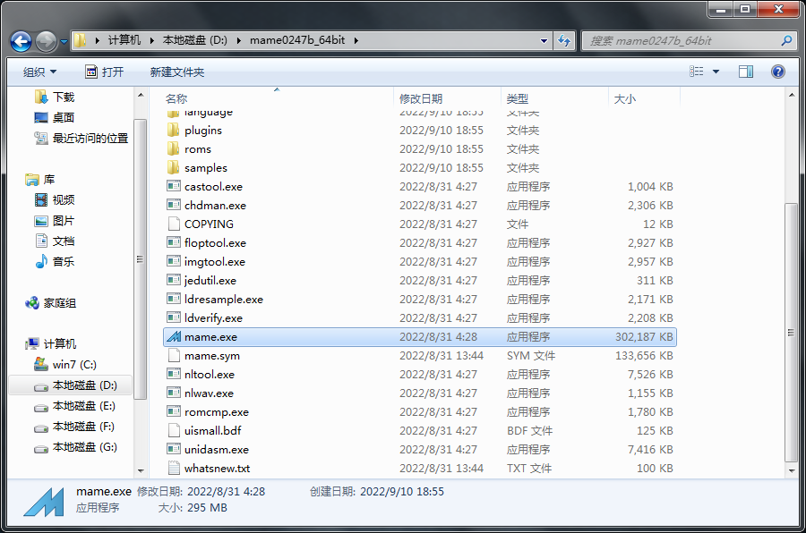
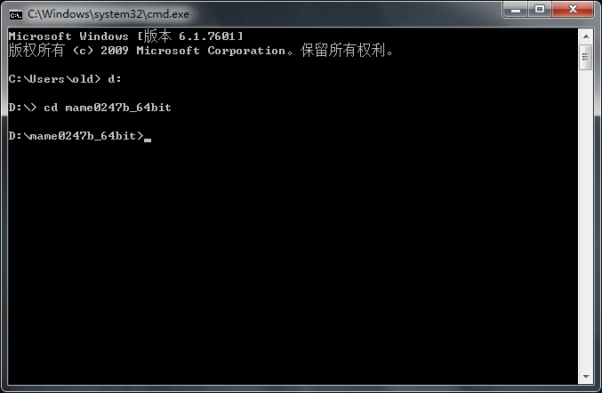
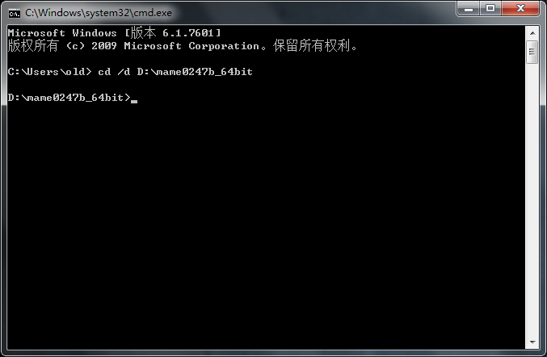
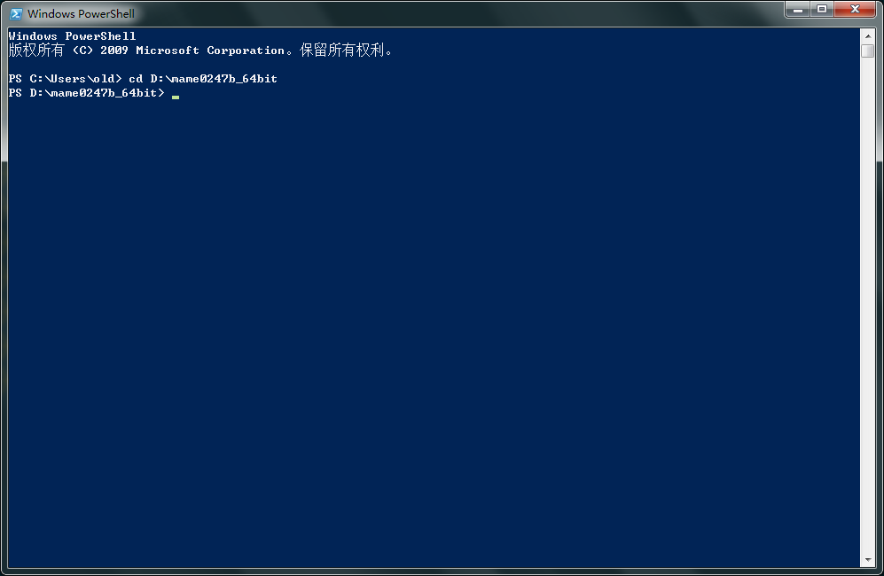
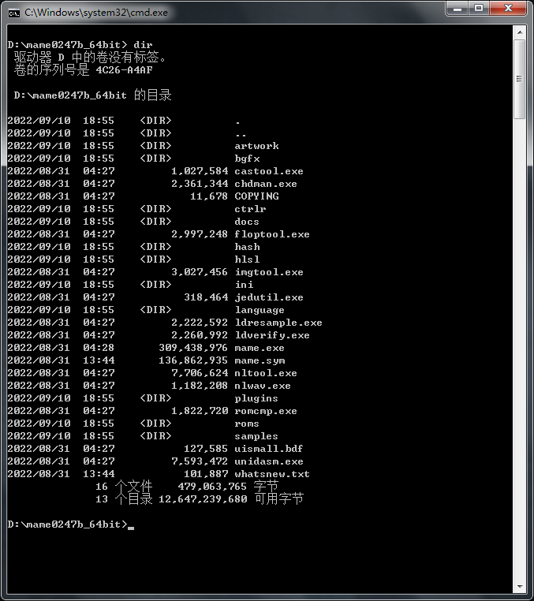

==========================================
切换文件夹
==========================================

mame 官网 发布的程序，好像都是 自解压 程序，随意 找个 文件夹 解压出来就可以用了。

不过，不要找 那种 权限 比较特殊的 文件夹。
MAME 在使用中：
修改的设置，需要写入配置文件；
游戏存档等也需要生成一些文件；
……。
如果 权限 比较特殊，MAME 没有 权限 修改文件、生成新文件，
会比较麻烦。

它 默认的 选项中，有关 文件/文件夹 路径 的，好像都是用的 相对路径。这样，不管把 MAME 解压在哪个位置使用，都没有关系。

但是，命令行中，目前好像是这种情况::
	
	mame 中 配置文件里的 相对路径，是相对于 命令行当前工作文件夹的。
	
	所以，首先，命令行里，先要把 当前工作目录 切换到 mame 所在文件夹。
	
	然后，再执行其它指令。

（ 目前 MAME 官方发布的 程序，都是 windows 平台的。
我找了个 linux ，Debian，试了一下，从操作系统的包管理器里，选择安装 mame ，发现它的默认配置文件 就不是用的 相对路径了。 ）

图形界面中 浏览文件夹
====================================

比如我们把 mame 0.247 版，解压到 ``D:\mame0247b_64bit`` 文件夹中。

在图形界面中，用鼠标点点点，很方便地可以找到我们需要的文件/文件夹，如下图：

cmd 进入文件夹
=================================
在 cmd 命令行中，CD 指令， 切换当前工作目录

进入上图中的 ``D:\mame0247b_64bit`` 文件夹。

指令为：
::
	
	D:
	cd mame0247b_64bit

或者：
::
	
	cd /d d:\mame0247b_64bit

或者：

说明
::
	
	C:
		进入 C 盘
	D:
		进入 D 盘
	E:
		进入 E 盘
	……
		……等等，以此类推
	
	cd "文件夹路径"
		进入一个文件夹，需要在同一个驱动器中（比如都在C盘），
	
	cd /d "文件夹路径"
		进入一个文件夹（可以在不同的盘）
	
	cd
		显示当前目录
		  如上图中，每一行提示信息就是当前目录，
		  这种情况的，一直能看到当前目录，就不用特意去查看当前目录了
	
	cd ..
		转到 上一层目录
		  两个点，相对路径的表示方法，表示 上一层目录
	
	cd \
	cd /
		转到 根目录
		  我试了一下，两个方向的斜杠，好像都可以
	
	注意：
	如果文件夹路径中有 空格 以及其它特殊符号
	用 英文 双引号 包起来
		"mame0247b_64bit"
		"d:\mame0247b_64bit"
	
	可以通过指令：
		help cd
		cd /?
		查看 cd 指令的帮助信息
	也可以网上搜索一下

PowerShell 进入文件夹
===================================
如果是 PowerShell 命令行，Set-Location 指令，切换当前工作目录
	
	（ CD 指令 是 Set-Location 别名，一样可以用，和 CMD 中的 CD 指令的用法 差不多 ）。

在 PowerShell 命令行 中，进入 ``D:\mame0247b_64bit`` 文件夹。

指令为：

::
	
	Set-Location D:\mame0247b_64bit
	
	或者 ：
	
	cd D:\mame0247b_64bit

::
	
	注意：
	如果文件夹路径中有 空格 以及其它特殊符号
	可能要用 英文 单引号 包起来
		'mame0247b_64bit'
		'd:\mame0247b_64bit'
	PowerShell 双引号 字符串 可能产生一些变量转义之类的
	用单引号

显示 当前工作目录 ，指令为 ：
::
	
	Get-Location
	
	或者 它的别名 pwd ：
	
	pwd
	
		显示当前工作目录
		  如下图中，每一行提示信息就是当前目录，
		  这种情况的，一直能看到当前目录，就不用特意去查看当前目录了

命令行，查看文件夹
===============================
在图形界面中，在资源管理器中，浏览、查看 文件/文件夹 很方便（如本页最上面的图片）。

在 CMD 命令行中，查看文件夹 ，用 dir 指令。

PowerShell 命令行的话，
PowerShell 中，有 Get-ChildItem 指令。
	
	| 别名有 dir ，符合 CMD 命令行 的习惯，和上面差不多了
	| 别名还有 ls