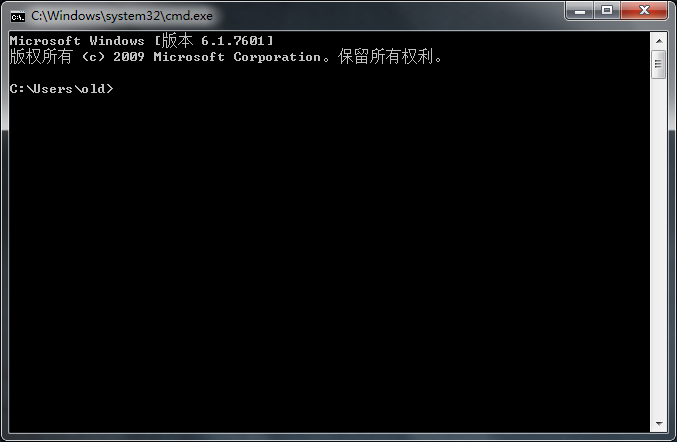
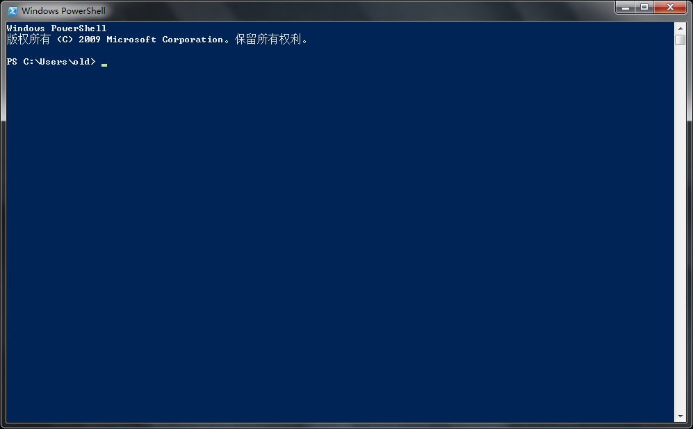

==========================================
cmd 与 PowerShell
==========================================

在 windows 操作系统中，有 cmd 命令行，有 powershell 命令行 等。

cmd 命令行 截图：

PowerShell 命令行 截图：

如果都没用过，想尝试一下，建议用 cmd ，简单点。

