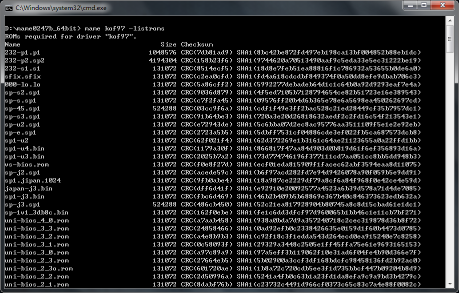

==========================================
mame 查看 roms 信息
==========================================

首先，CMD 命令行中，进入 mame 所在文件夹

显示 游戏 kof97 的 游戏文件 信息
::
	
	mame kof97 -listroms
		这条指令，显示的信息，比较简单
	
	mame kof97 -listxml
		这条指令，显示的信息，比较多，但，还有其它的信息
		
		如果是非常老版本的，好像没有 -listxml 这条指令，好像是 -listinfo

如上图：listroms 指令，看到的内容，比较清晰，
文件名、文件大小、文件的 crc 校验值、文件的 sha1 校验值，
一列一列，很清晰；

但是，表达的信息太少。
比如，bios 文件 neogeo.zip 中，已经有的文件是哪些，此处就看不出来。

listxml 指令，导出信息，比较详细，但是，其它信息又有点多。
这里就不贴内容了，太多太杂。

-----------

可以人工整理几个游戏试试，了解一下整理的方法。

多的话，学会用软件整理。

人工查看、对比 roms 信息，这样操作的效率 很低，实际使用的话，
可以使用 ClrMamePro 等 软件，来 整理 游戏文件，
批量操作，快速、准确。

当然，简单点的话，可以下载别人整理好的合集， 如果分享资源的大佬会用 ClrMamePro 等软件， 游戏文件是他 整理 过的， 没有什么问题。

也会有一些喜欢分享的大佬，其实不太会整理游戏文件， 这种情况的话，最好自己再整理一下。