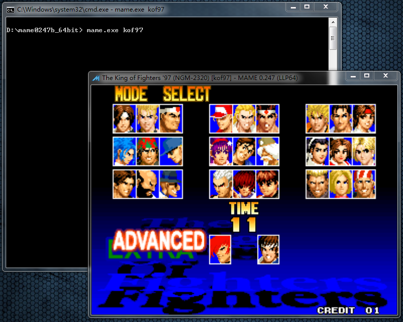

==========================================
mame 运行游戏
==========================================

图形界面中，在游戏列表中，选中游戏，运行游戏很方便。

在 CMD 命令行中，运行指定游戏：

首先，命令行 进入 mame 程序 所在文件 ``d:\mame0247b_64bit`` 。（见前面的章节）

然后，用其中的 mame.exe 运行 游戏 kof97 
	
	命令行中，运行的游戏名使用的是英文缩写，
	游戏的英文缩写是什么，
	可以在游戏列表界面中查看。

::
	
	指令为：
	.\mame.exe kof97
	相对路径的表示方法，一个点表示当前文件夹
	
	或者省略一个点(上图中，使用的这一条)：
	mame.exe kof97
	
	
	注 mame.exe 还可以省略为 mame，指令为：
	.\mame kof97
	或：
	mame kof97
	
	（.exe 、.bat 、…… 等 一些可以在命令行里执行的程序，后缀 可以省略）
	（但如果同时有 mame.exe 、mame.bat 、…… 等，后缀名不同，文件名重复，这种时候，不要省，否则自己都分不清运行的是哪一个）
	
	注：
	  PowerShell 命令行，好像不可以省一个点。
	  保留一个点，强调 当前文件夹。
	  用：
	  .\mame.exe kof97

--------------

像上面这样，仅仅 在命令行中 打开一个游戏还是很简单的。
	
	``mame.exe kof97``

如果有其它选项，写在后面，比如选项 -window （窗口模式）：
	
	``mame.exe kof97 -window``

如果是 PowerShell 命令行行，不要省略一个点，写完整，强调 当前文件夹里的 mame.exe ：
	
	``.\mame.exe kof97 -window``

mame 有 很多 各种 选项的指令，具体可以查看 官方网站 的说明。

用不着 每一次运行游戏 都 在命令行里输入一大串指令
	
	图形界面的的话，可以鼠标点击相关的选项，修改设置
	
	即使 偏爱 使用命令行 操作，也可以导出配置文件，手动修改相关选项

