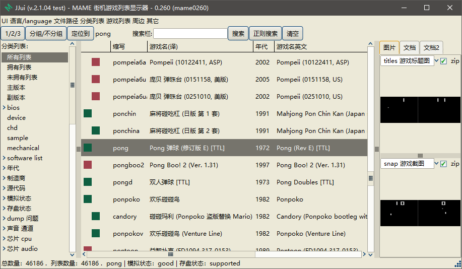

==========================================
JJui 街机游戏列表显示器
==========================================

简介：
==========================================

　　JJui 是一款配合 MAME 使用的 前端／UI／GUI 。

　　其它的类似的软件：

　　　　比如，M+GUI (一般文件名为 mamepgui.exe)： http://www.ppxclub.com/669953-1-1

　　　　比如，MxUI ：https://www.ppxclub.com/671046-1-1

　　因为我本人，不是专业的程序员，所以水平就呵呵了。

　　程序不管好不好，反正能用了。不过，不是专业人员，不知道发给别人用兼容性怎样。如果 遇到 bug 什么的比较多的话，见谅。

　　程序呢，功能上来说，比较简单。简单来说，就是帮助 MAME 显示游戏列表用的，顺便查看一下 游戏的预览图片、文档 之类的。

　　中文游戏列表的翻译文件：``.jjui\translation.txt``，是纯文本格式的(编码 utf-8 bom)。可以直接用文本编辑器打开自己编辑。也方便复制网络上已有的资源。

预览：
==========================================

　　外形上来看，比较简单。把需要的零部件安排在指定的位置上；各零部件形状的微调，没有具体的去操纵。不过，还好，有一些可以用的第三方的主题，有一些看起来，也还不错。

　　切换内置主题的话，在菜单里，找到选项，换一下，然后，关闭程序，重新打开就行了。

　　切换第三方主题的话，把我打包的第三方主题包，放在指定的位置，然后，在菜单里，找到选项，换一下，然后，关闭程序，重新打开就行了。

　　选择符号，叉(×) 符号 与 勾(√) 符号。不同的主题，表示含义的可能是相反的。有的主题用 勾(√) 表示选中；但，有的主题用 叉(×) 表示选中。强迫症不能忍的话，你就换个主题。

以下是预览图：

如下图：内置主题 clam 。内置主题，有几个不同的可以选择。

.. image:: images/001_preview_1.png
   :alt: 此处应显示图片

除了内置的主题，还有第三方的主题，也可以使用。如下图：

下面，也是第三方的主题：

.. image:: images/001_preview_3.png
   :alt: 此处应显示图片

下面，也是第三方的主题：

.. image:: images/001_preview_4.png
   :alt: 此处应显示图片
   
下面，也是第三方的主题：
   
.. image:: images/001_preview_5.png
   :alt: 此处应显示图片

…… ……

…… ……

…… ……