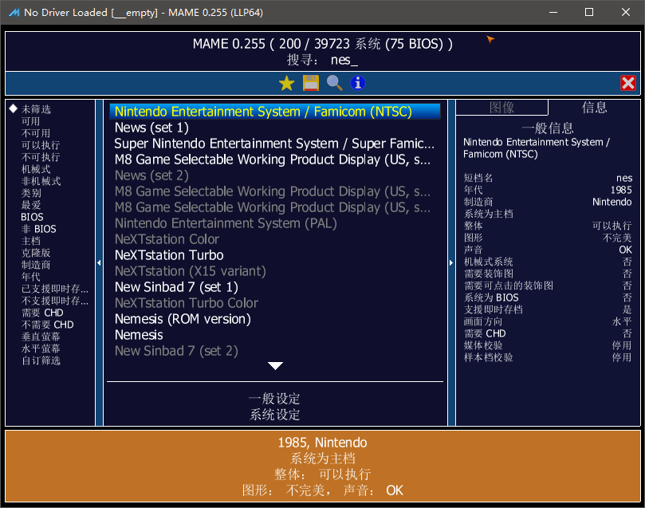
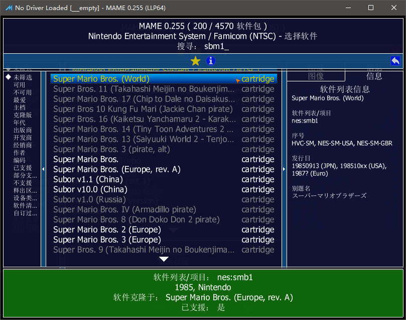
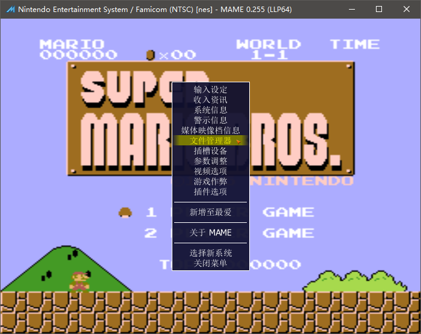

==========================================
用 MAME 打开 software list
==========================================

不使用其它前端的话，使用原版的 MAME 也可以打开 software list 中的游戏。

窗口模式打开
===================
MAME 从 0.162 版本开始，合并了 MESS 功能。

从游戏列表打开，需要版本新一点的。

打开 MAME ，主列表中搜索到 游戏机 nes,如下图

进入 游戏机 nes 的第二层列表，显示各种游戏，搜索到 游戏 smb1 ,如下图

这样子，找到游戏了，就可以进入游戏了。（当然了，各种游戏文件得是正确的。）

游戏中切换游戏
===================
游戏中，按 Tab 键，弹出菜单，选择 文件管理器，

然后，可以另外再选择其它的游戏。

命令行模式打开
===================
具体可以去 MAME 官方网站，以及 MESS 以前的网站，看看说明。

用 游戏机 nes 打开 nes.xml 中记录的游戏 smb1

mame.exe nes -cart nes:smb1

::
	
	mame.exe 模拟器程序
	nes 表示 游戏机 nes
	-cart 表示 游戏卡带 类型，和 游戏卡带类型 有关，不同情况下，值不同
	nes:smb1 ，写的比较详细，表示 nes.xml 中 的 游戏 smb1

存档位置设置
===================

游戏机本身如果有存档功能的话，对应的文件好像默认是保存到 nvram 文件夹里的。这里说的麻烦的不是这种。

另外一种存档功能，模拟器提供的存档供能，对应的文件好像默认是保存到 sta 文件夹里的，这种存档位置比较麻烦，得设置一下。反正目前还是很麻烦的，麻烦的地方在于每一个种类都需要设置一下。
	
	| shift+F7 选择存档位置
	| F7 选择读档位置
	
	不过这种存档位置，默认，一个游戏机使用同一个位置。
	然而，一个游戏机比如 nes ，有几千个游戏，不方便。
	
	| 默认的存档位置重叠了：
	| 比如，运行游戏机 nes 加载游戏 smb1   存档时按A键：默认保存到 sta\\nes\\a.sta
	| 比如，运行游戏机 nes 加载游戏 contra 存档时按A键：默认保存到 sta\\nes\\a.sta
	| 几千游戏存在一起了
	
	所以，最好另外设置一下。
	
	| 可以设置成这样：
	| 比如，运行游戏机 nes 加载游戏 smb1   存档时按A键：设置后保存到 sta\\nes\\smb1\\a.sta
	| 比如，运行游戏机 nes 加载游戏 contra 存档时按A键：设置后保存到 sta\\nes\\contra\\a.sta
	| 这样不同的游戏就区分开来了，nes 的几千个游戏都可以互不影响
	
	| 具体是 statename 这个选项。
	| 游戏机 nes 的话，这个选项可以设置为 %g/%d_cart 。
	| 其它 游戏机 的话，可能不同，但大致有几大种类。
	| 具体可以去 MAME 官方说明里查看一下。
	
	如果直接使用 MAME 的话，每一个机种，都设置一下就行了,很麻烦。
	
	如果 JJui_sl 使用的话，可以直接设置到 运行参数里，也很麻烦。
	