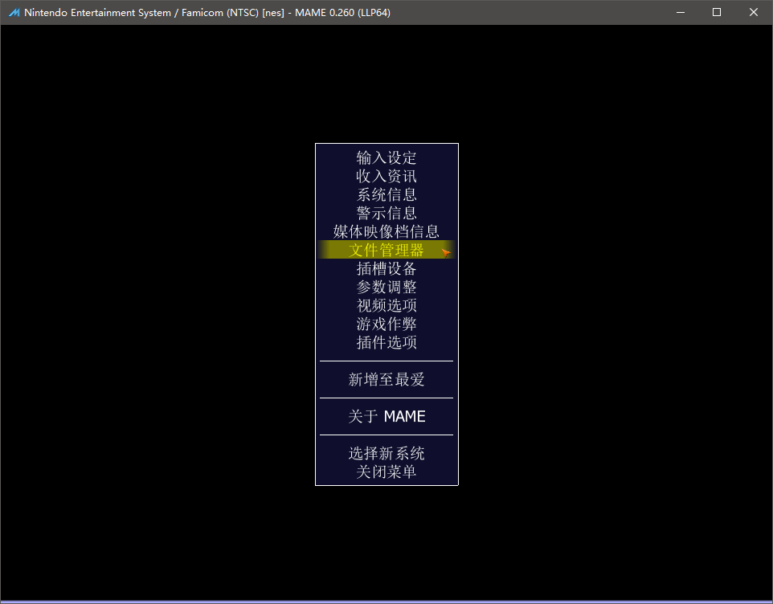

==========================================
用 MAME 打开 software list
==========================================

不使用其它前端的话，使用原版的 MAME 也可以打开 software list 中的游戏。

窗口模式打开
===================
MAME 从 0.162 版本开始，合并了 MESS 功能。

从游戏列表打开，需要版本新一点的。

打开 MAME ，主列表中搜索到 游戏机 nes,如下图

进入 游戏机 nes 的第二层列表，显示各种游戏，搜索到 游戏 smb1 ,如下图

进入游戏，如下图

.. image:: images/mame_nes_sbm1.png
   :alt: 此处应显示图片

游戏中切换游戏
===================
游戏中，按 Tab 键，弹出菜单，选择 文件管理器，

然后，选择具体的游戏......

命令行模式打开
===================
具体可以去 MAME 官方网站，以及 MESS 以前的网站，看看说明。

用 游戏机 nes 打开 nes.xml 中记录的游戏 smb1

mame.exe nes -cart nes:smb1

::
	
	mame.exe 模拟器程序
	nes 表示 游戏机 nes
	-cart 表示 游戏卡带 类型，和 游戏卡带类型 有关，不同情况下，值不同
	nes:smb1 ，写的比较详细，表示 nes.xml 中 的 游戏 smb1

存档位置设置
===================

模拟器提供的存档供能::
	
	shift+F7 选择存档位置
	F7 选择读档位置
	
	不过这种存档位置，
	默认，
	一个游戏机使用同一个位置，
	然而，一个游戏机比如 nes ，有几千个游戏，不方便。
	
	最好另外设置一下。
	
	具体是 statename 这个选项。具体可以去 MAME 官方说明里查看一下。
	
	如果直接使用 MAME 的话，每一个你自己使用的机种，都设置一下就行了。
	
	如果 JJui_sl 使用的话，可以直接设置到 运行参数里。