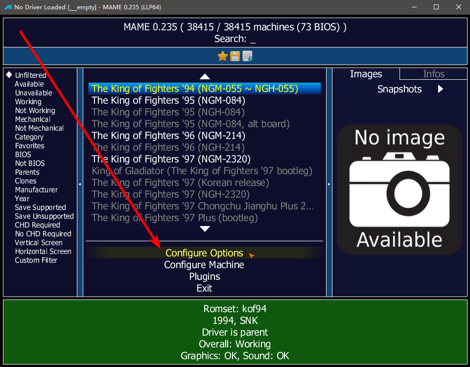
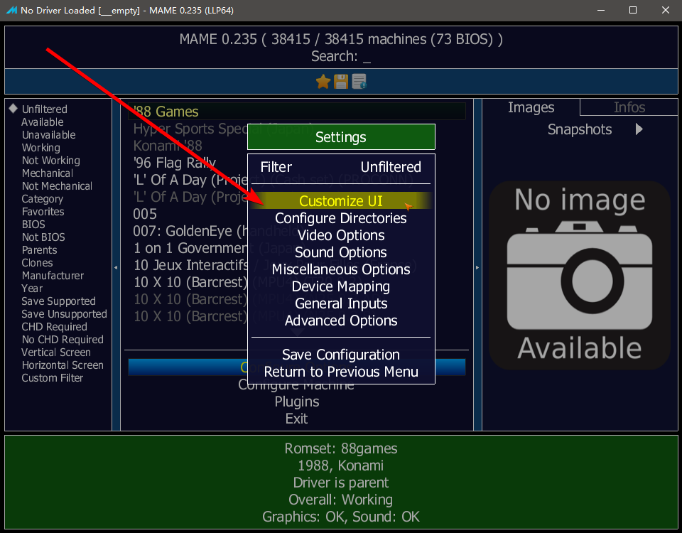
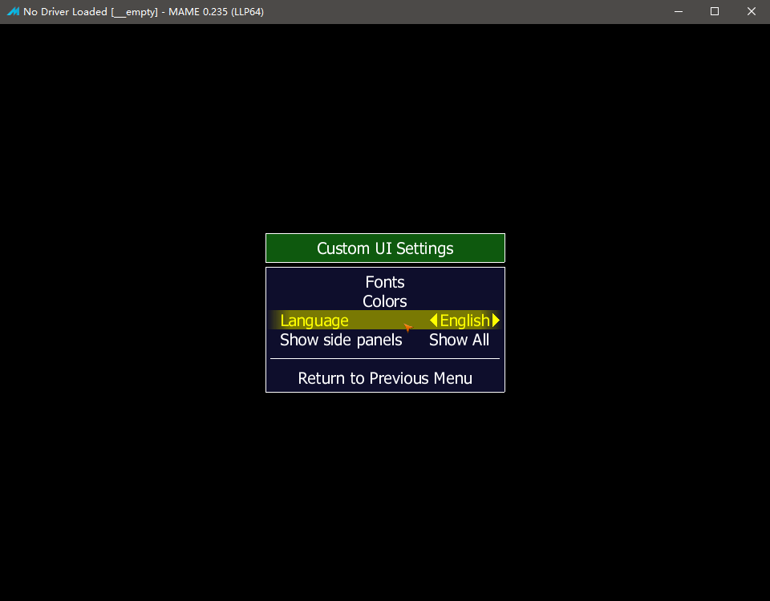
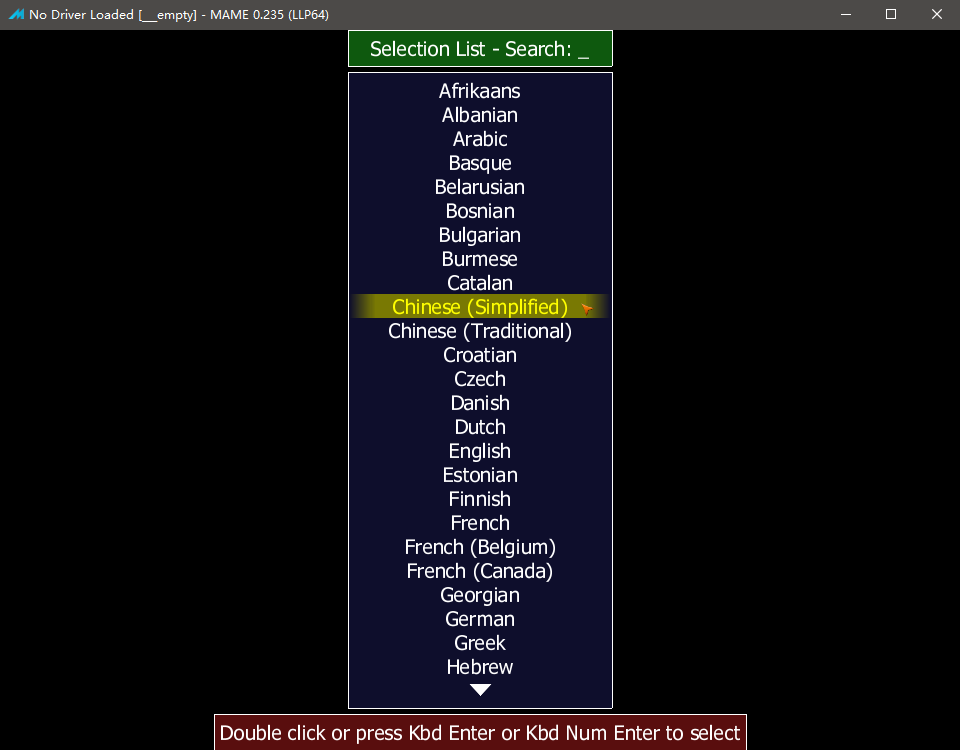
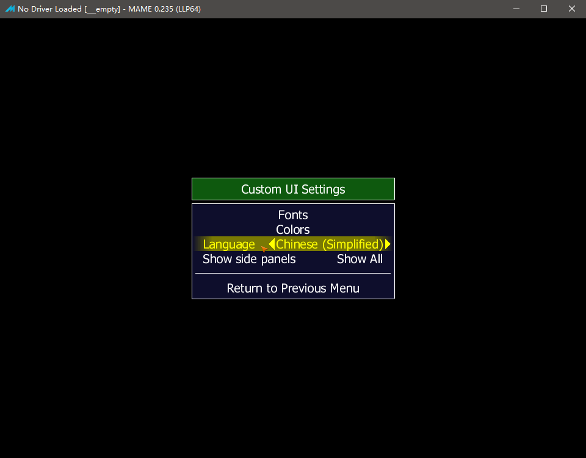
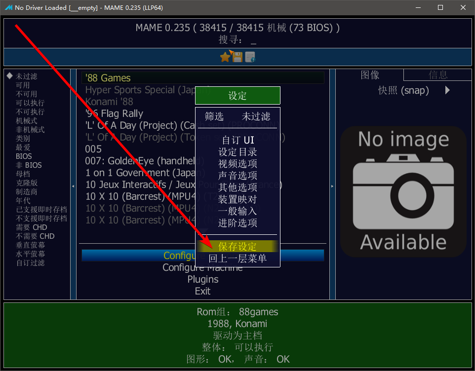
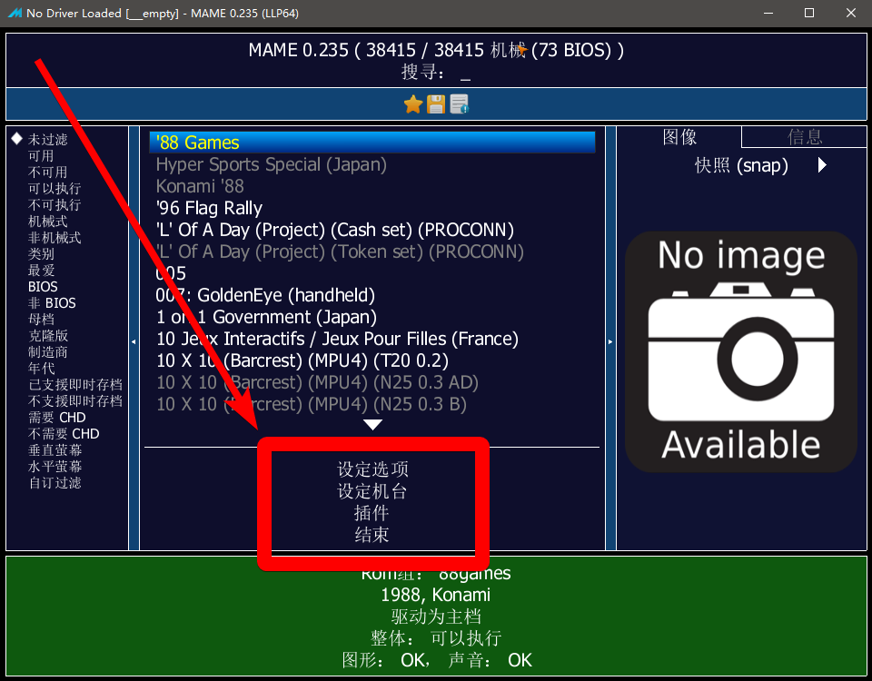
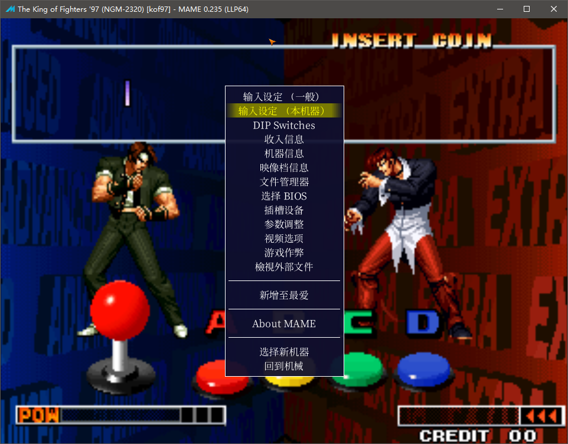

==========================================
MAME 模拟器设置
==========================================

| 　　JJui 程序，用 MAME 打开游戏时，会从 MAME 所在的文件夹打开它。
| 　　放便 MAME 读取自己的设置。
| 　　而你必要把 JJui 和 MAME 放在同一个文件夹。
| 　　尤其是把 脚本 转成 exe 格式的话，附带的文件数量可能很多，不放便放在同一个文件夹。

| 　　提醒一点：
| 　　　如果从官网下载的，没有人设置过，那么，MAME 默认设置的路径，都是相对路径，这样方便你把 MAME 随意解压到某个位置就能使用。
| 　　　这样对于想把游戏放在 U 盘的用户很方便。
| 　　　如果你也需要 放在 U 盘，或者，需要经常复制到的别的电脑；
| 　　　那么，有关于位置的选项（比如游戏放在哪里、作弊码放在哪里），就得使用 相对路径 或者 干脆 就使用默认路径。

　　官方原版 MAME ，新版本的话，已经可以选择中文菜单，也可以方便一些选项设置了。本编的内容，简单聊一下，怎样切换到中文菜单，然后，自己对模拟器，进行一些必要的设置。

　　友情提醒，注意备份。尤其是新玩家的话，可能需要先熟悉、了解一下模拟器的选项，所以选项操作可能比较多、比较乱。有些选项，设置错了以后，可能模拟器整个就不好使了。这时候，有备份就没什么关系了，删掉了以后，重新再来。

　　进入游戏之前的设置，整体的设置，一般保存在 配置文件 mame.ini 中。

　　早期的版本呢：如果你用官方原版 MAME ，需要在命令行界面，输入指令，导出配置文件 mame.ini ，然后手动修改 mame.ini 文件。或者 用一个方便设置的 UI／前端 程序，帮助你设置。当然，还有非官方版本的模拟器，直接就添加了很多人性化的功能，但是 非官方 的 版本 ，通常 维护 的人员很少，比如 MamePlus 到 0.168 版后，就没有更新了(最后的一些版本,感觉 bug 也比较多)。

　　好像从 0.171 版本以后，MAME 官方原版，就添加了设置的选项。这样一来，一般的设置，就可以在 MAME 模拟器上边，用鼠标点点点进行操作了。

　　JJui 目前，没有帮助 MAME 设置 mame.ini 的选项，以后也不用做相关的功能。因为，既然 官方 MAME 已经有了这方面的功能，那 其实用不着花功夫去做相同的功能。而且我还不是专业的程序员，不管做什么，都比较费功夫。

　　其实手动修改 mame.ini 也挺方便，但你得熟悉 mame.ini 里面的选项。

　　（还有其它的配置文件，这里没有提到：比如 按键设置 一般都 保存在 cfg 文件夹里、……、……）

　　那么，打开 官方原版 MAME ，第一件事呢，就是把选项菜单，调成中文。可惜，游戏列表，仍然是 英文的。

   
　　如上图：点击 Configure Options (选项设置)
   

　　如上图：点击 Customize UI (设置 UI)

   
　　如上图：点击 Language (语言)

   
　　如上图：选中 Chinese Simplified (简体中文)；底下红字提示：双击(Double Click) 或 按回车键(Press Enter) 选择。

   
　　如上图：回到上一层，看到 Language (语言) 选项的值 已经是 Chinese Simplified (简体中文)   

   
　　如上图：回到上一层，点击 Save Configuration (保存设定)

　　那么，现在，选项菜单，已经是简体中文的了。

　　这里，看一下，进入游戏之前，的设置，如下图，有【设定选项】、【设定机台】、【插件】三个选项。其中具体的，你可以自己点进去看一看。其中 【设定选项】 是整体的设置；【设定机台】机台是对某个游戏的设置；【插件】可以选择 使用 哪些 插件。

   
　　那么，如下图，进入游戏之后，按 Tab 键，弹出菜单，这里还有设置选项。一般按键的设置，以及一些 Tab 菜单里的选项，会保存在 cfg 文件夹里，差不多吧，我也不是很确定。
   

   
　　整体上来说，游戏之前的选项菜单、进入游戏之后的 Tab 菜单，都已经可以选择使用中文了。但是，翻译可能不太完整，有些地方可能还没有翻译到（也可能是 程序员 没有给 翻译人员 做好准备工作）。

　　那么游戏列表，还是英文的。要想用中文游戏列表的话，可以使用一些 支持 中文游戏列表的 UI／前端 来帮助显示中文游戏列表。
