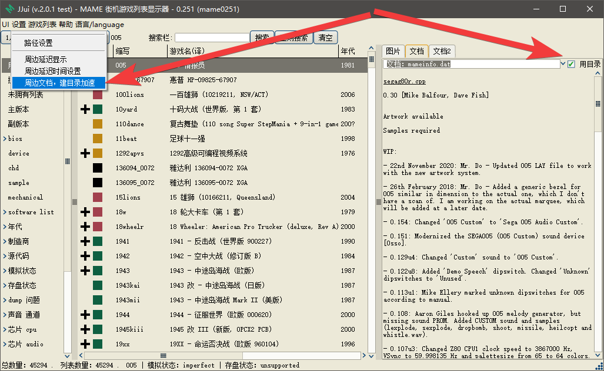

======================================
周边文档 建目录 加速
======================================

在菜单里，找到选项，设置好 周边文档 的路径。

在菜单里，找到，周边文档 建目录 的选项，建立目录。

在 文档显示区，勾选 用目录，使用目录。

不建立目录，搜索整个文件：如果搜索的内容，靠前，还好，用的时间可能不多；如果搜完整个文件，没有搜到内容，非常耗时间；如果搜索到的内容靠后，也很浪费时间。

建立目录，记录要搜索的内容 所在的位置；然后使用目录。这样，就不用搜索整个文件；而是直接跳转到指定的位置，读取内容。

如果你更新了 文档，文档内容的位置发生了变化，则需要，重新建立目录。否则，目录不正确，基本读不到内容的。

