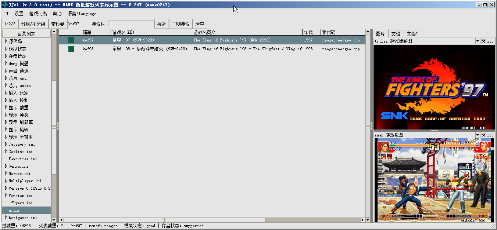
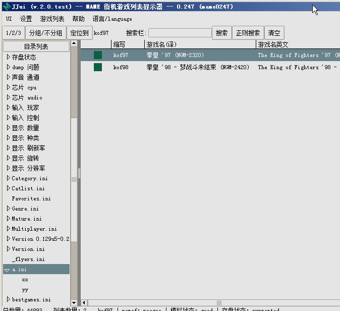
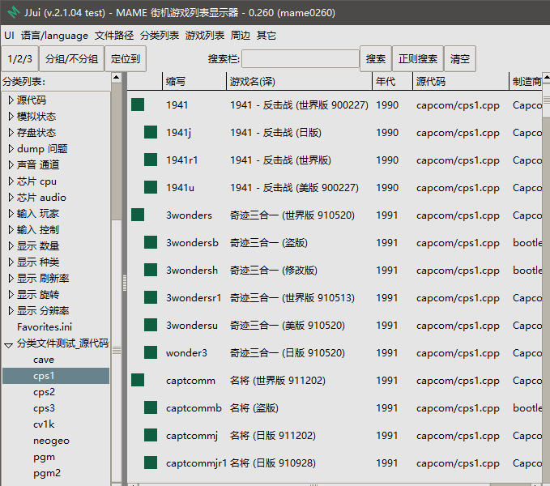

===============================================
目录
===============================================

内置目录
=================================
JJui 内置的目录（其它 UI 通常都会有），位于 JJui 左侧。这种的话，可以方便你浏览查看不同类型的游戏。
	
	.. image:: images/index_internal.png

第三方目录、自定义目录 保存位置
=========================================
默认是 folders 文件夹（相对于 JJui ）

你可以在 JJui 菜单中，找到路径相关的设置，查看 、修改。

第三方目录资源
=================================

比如：
	
	https://www.progettosnaps.net
	
	这个网站时面就有一些
	
	首面有个列表里，里面的::
		
		BestGames
		Category
		CatVer
		Languages
		Series
		Version
		…… 等

下载下来，找到其中的 \*.ini 文件，放入 默认是 folders 文件夹（或者你修改过），重新打开 JJui ,查看效果。

第三方目录 \*.ini 文件格式
==================================================
\*.ini 文件，比较常见的文件名后缀

字符编码
---------------

JJui 为了简单一点，文件的 文本编码统一使用 utf-8 带 bom 
	
	utf-8 无 bom 也不影响读取，不过如果在 JJui 中编辑 并保存的话，会改为 utf-8 带 bom 。
	
	utf-8 字符编码 兼容 ASCII 字符编码，可以读取 纯英文的 ASCII 编码的文件
	
	对其它 UI 
		
		英文版的 MAMEUI 这样的，utf-8 带 bom，它可能不认，你自己试试保存为 uft-8 无 bom 或其它编码
		
		MxUI ，utf-8 有没有 bom ，好像没有关系
		

.ini 文件格式
----------------------

格式的话，随便复制一个文件过来参考一下就行了。

比如有个文件 a.ini ，内容为 ：
::

	[FOLDER_SETTINGS]
	RootFolderIcon golden
	SubFolderIcon golden

	[ROOT_FOLDER]
	kof97
	kof98

::

	说明：
	
	[FOLDER_SETTINGS]      * 译：目录设置
	RootFolderIcon golden  * Root Folder Icon（主目录图标），值为 golden
	SubFolderIcon golden   * Sub Folder Icon（子目录图标)，值为 golden
	                       * 有些 ui 中 可以设置 图标 的颜色 或者 形状。
	                       * JJui 目前 没有为此添加图标
	
	[ROOT_FOLDER]          * 主分类
	kof97                  * 拳皇97 游戏名英文缩写（英文缩写 参考 游戏列表）
	kof98                  * 拳皇98 游戏名英文缩写（英文缩写 参考 游戏列表）

在 JJui 菜单里，找到路径相关的设置，查看 外部目录 所在位置默认是 folders 文件夹，（也可以修改）。

把 a.ini 文件放入 其中。

关闭 JJui ，重新打开，如下图。

.ini 多重分类，文件格式
--------------------------------

| 之前说的单层分类的文件，
| 如果要添加两个子分类 xx 、yy ，
| 可以在内容后添加 。
| 内容如下，用 英文 方括号 包起来的，表示建立一个子分类
| 每个分类，至少要添加一个游戏（因为有的 前端 可能不显示 空的 子分类）

::
	
	[FOLDER_SETTINGS]
	RootFolderIcon golden
	SubFolderIcon golden
	
	[ROOT_FOLDER]
	kof97
	kof98
	
	[xx]
	kof97
	
	[yy]
	kof97

JJui ，新增分类文件 \*.source_ini
===========================================================================
JJui 添加的功能，按 源代码分类 

这样方便把常见的，以源代码分类的类型列出来，

这一类，只能手动编辑，不能在 UI 里编辑

格式和之前的一样，元素改为源代码
	
	之前说的，元素为 游戏 英文缩写
	
	这里 元素为源代码，源代码名 参考 游戏列表中显示的内容（MAME 不同版本，这个值可能不同）
	
	::
		
		比如 capcom/cps1.cpp (新版本改格式)
		比如 cps1.cpp (老版本改格式)
		比如 cps1.c (更老的版本)
		具体可以对比游戏列表中显示的内容，如下图

JJui_sl ，分类文件 \*.sl_ini
===========================================================================
格式和前文中 JJui 的 分类文件一样

JJui 分类中，元素 为 游戏英文名缩写，比如 kof97 、kof98 等。

JJui_sl 分类中，元素 为 xml名称 加 一个(英文)空格 加 游戏英文名缩写。

比如： nes smb

比如： nes smb1

JJui_sl ，分类文件 \*.xml_ini
=================================================================
格式和之前的一样

元素为 xml 名称，这样方显把常见的 xml 选出来
	
	可以在游戏列表中看到，比如 nes 
	
	同时，也对应于 hash 文件夹中的 \*.xml 文件，比如 nes.xml

这一类，只能手动编辑，不能在 UI 里编辑

元素名为：

比如：nes

比如：gba

