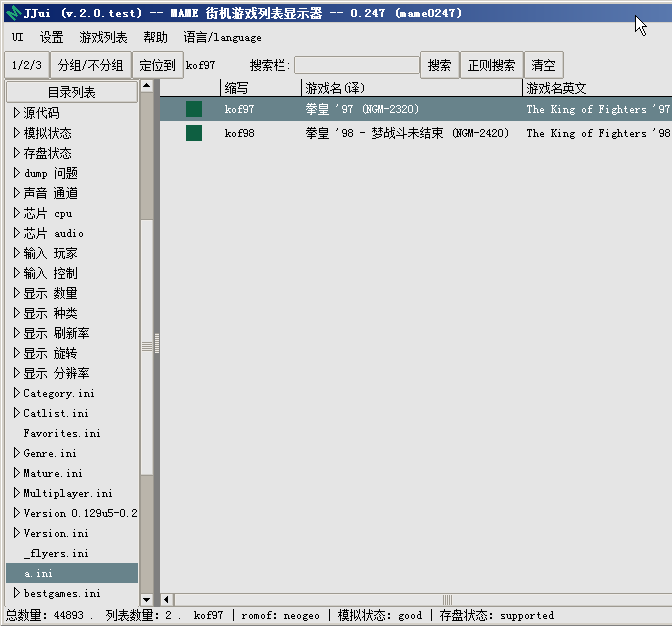

=========================
分类文件
=========================

JJui ，分类文件 \*.ini
==================================================
这种是 常见的 分类文件，和其它的 MxUI ,MAMEUI 一样的，就是格式需要 utf-8 带 bom 。

格式的话，随便复制一过文件过来参考一下就行了。

文本编码 utf-8 有没有 bom 应该都能读取 。

utf-8 没有 bom 的话，如果你在 JJui 中修改过此文件，手动保存后，会统一转为 utf-8 带 bom 。

如果你不想修改分类文件，把它属性设置为只读。

兼容性：

MAMEUI 这样的，添加了 bom 以后，它可能不认，你自己去掉 bom 就行了

MxUI 这样的，有没有 bom ，好像没有关系。

比如有个文件 a.ini ，内容为 ：
::

	[FOLDER_SETTINGS]
	RootFolderIcon golden
	SubFolderIcon golden

	[ROOT_FOLDER]
	kof97
	kof98

::

	注：
	  * JJui 的话，字符编码用 utf-8 带 bom
	[FOLDER_SETTINGS]
	  * 译：目录设置
	RootFolderIcon golden
	  * Root Folder Icon （主 目录 图标），值 为 golden（金色） 值可以修改。
	  * 有些 ui 中 可以设置 图标 的颜色 或者 形状。
	  * JJui 目前 没有为此添加图标
	SubFolderIcon cust2
	  * Sub Folder Icon（子目录图标 )，值为 golden，值可以修改。
	  * 有些 ui 中 可以设置 图标 的颜色 或者 形状。
	  * JJui 目前 没有为此添加图标
	
	[ROOT_FOLDER]
	  * 主分类
	kof97
	  * 拳皇97 游戏名英文缩写（每个游戏的 英文缩写 参考游戏列表）
	kof98
	  * 拳皇98 游戏名英文缩写（每个游戏的 英文缩写 参考游戏列表）

在 JJui 菜单里，找到路径相关的设置，查看 外部目录 所在位置默认是 folders 文件夹，（也可以修改）。

把 a.ini 文件放入 其中。

关闭 JJui ，重新打开，如下图。

::

	如果要添加两个子分类 xx 、yy
	可以在内容后添加
	至少要添加一个游戏，因为有的 前端 可能不显示 空的 子分类
	
	[xx]
	kof97
	
	[yy]
	kof97

.. image:: images/folders_multi.png
   :alt: 此处应显示图片

JJui ，新增分类文件 \*.source_ini
===========================================================================
JJui 添加的功能，按 源代码分类 

格式和之前的一样，

之前说的，元素为 游戏 英文缩写。

这里 元素为源代码名，
::
	
	比如 capcom/cps1.cpp (新版本改格式)
	比如 cps1.cpp (老版本改格式)
	比如 cps1.c (更老的版本)
	具体可以对比游戏列表中显示的内容，如下图

这样方便把常见的，以源代码分类的类型列出来，

这一类，只能手动编辑，不能在 UI 里编辑

JJui_sl ，分类文件 \*.sl_ini
===========================================================================
格式和前文中 JJui 的 分类文件一样

JJui 分类中，元素 为 游戏英文名缩写，比如 kof97 、kof98 等。

JJui_sl 分类中，元素 为 xml名称 加 一个(英文)空格 加 游戏英文名缩写。

比如： nes smb

比如： nes smb1

JJui_sl ，分类文件 \*.xml_ini
=================================================================
格式和之前的一样

元素为 xml 名称，这样方显把常见的 xml 选出来
	
	可以在游戏列表中看到，比如 nes 
	
	同时，也对应于 hash 文件夹中的 \*.xml 文件，比如 nes.xml

这一类，只能手动编辑，不能在 UI 里编辑

元素名为：

比如：nes

比如：gba

