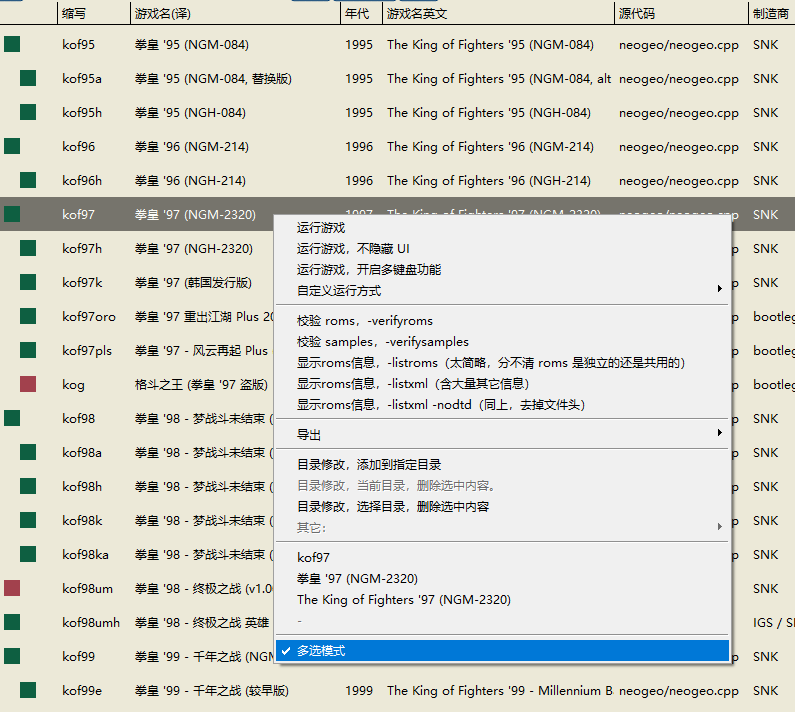
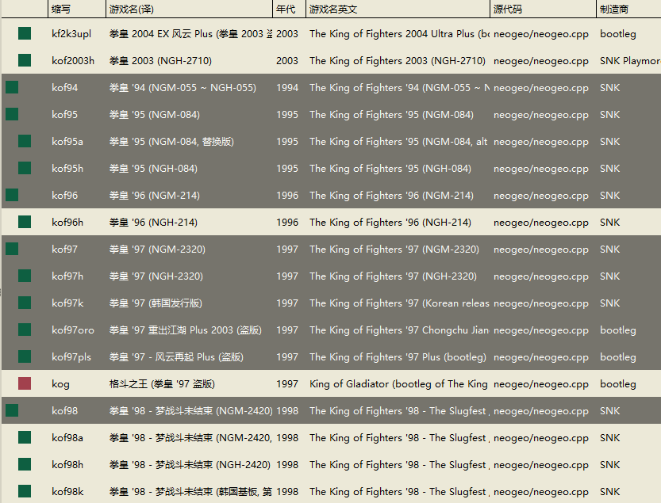

==========================================
列表 多选模式
==========================================

目前，三个列表：不分组列表、分组列表、分组 可展开 可收起 列表。三个列表 的 多选 模式 要分别开启。

多选模式，是为了 方便 编辑 自定义目录 的。可以 批量地 添加、删除 列表。

自定义目录 编辑 后，需要自己手动保存。在 目录处，鼠标右击，弹出菜单，选保存。

::
	
	Ctrl + A ,全选
	按住 Ctrl 同时 点击 鼠标，一个一个地选择
	按住 Shift 同时 点击 鼠标，点击列表两处，选择一个范围

在列表中，鼠标右击，弹出菜单，选择 多选模式。

如下图，多选：

