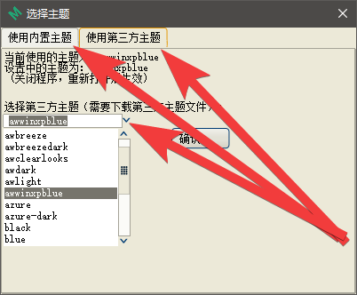

======================================
主题
======================================

内置的主题，只有几个。内置主题的话，在菜单中，找选项，可以修改少量的颜色。

第三方的主题，也有几个，使用别人定义的好的配色方案。

第三方主题，需要用我提供的主题包。如果没有下载的的话，可以下载下来，放在指定的位置。默认放在这个文件夹里：``.jjui\themes\*.*``

(如果没有第三方主题包的话)下载我提供的第三方主题包，放在指定的位置。

在菜单里，找到 更换主题 的选项。

如下图，选择 内置主题 或者 第三方主题，然后，各种主题下拉菜单，点击，选择不同的主题。

UI 界面，整体上比较简单。

字体大小，可以在菜单里，找到选项，修改大小。

内置主题的话，颜色方面，可以在菜单里，找到选项，颜色可以稍微调节几种。

如果会修改第三方主题的话，可以自己修改对应的第三方主题文件，随意修改颜色。

背景图片 这样的 功能，没有。