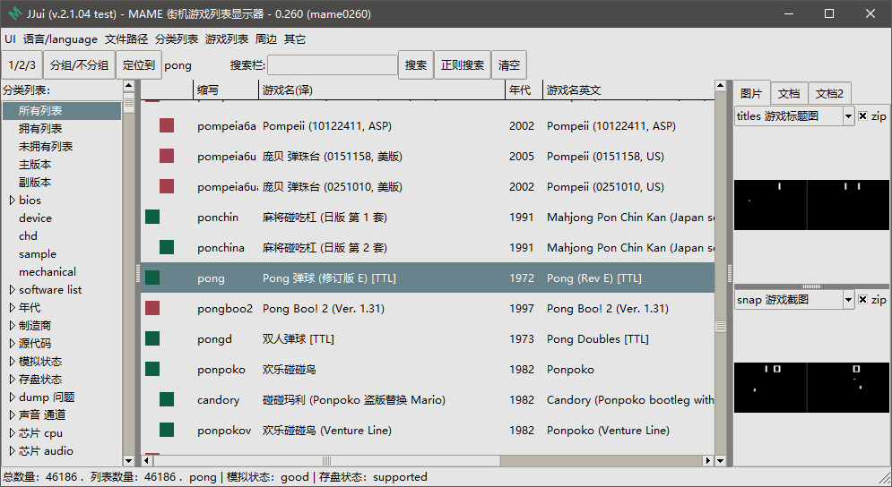
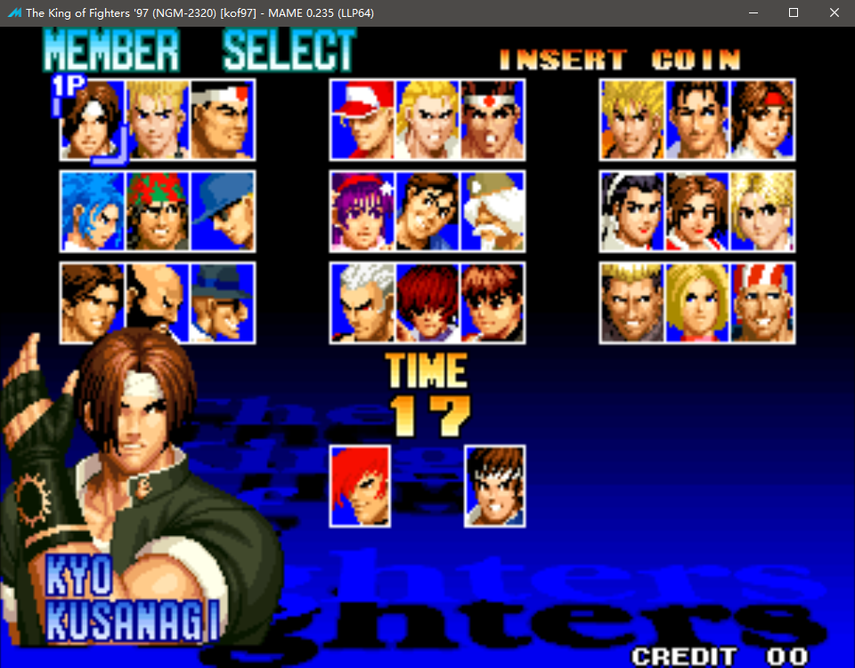

==========================================
运行
==========================================

准备好 JJui 程序
==========================================

准备好 JJui 程序，下载好程序。

压缩包 解压 到 某个 文件夹里。

　　
准备好 MAME 程序
==========================================

下载好 MAME 程序。

官网的 MAME 程序，是自解压程序，解压缩到 某个 文件夹里。

JJui 1.0，因为 0.162 版本开始，MAME 合并了 MESS ，导出的数据内容有一点不一样了，所以 MAME 使用 0.162 以上的版本。

JJui 2.0 ，MAME 可以用 之前 的版本，不过，初始化时，需要选择一下老版本。

准备好 游戏列表 翻译文件
==========================================

翻译文件：``.jjui\translation.txt``，文本格式 字符编码为 utf-8 带 bom ( utf-8 没有 bom 也应该不影响读取内容)。

如果已经有了这个文件，可以用文本编辑器打开查看一下，大致翻译了多少行内容。

	可能我准备的仅仅是一个样本，
	仅翻译了几行内容，
	更多的内容，
	需要你自己去补充。
	
	网上翻译的资源，可以复制过来用。

| 格式为：
| 每一行的开头为 游戏的 英文缩写；
| 之后，一个 制表符号 分隔一下；
| 之后，是翻译的内容；
| 如果之后，出现第二个 制表符号，此 制表符号 以及 后面的内容会被忽略，这个是为了兼容之前 MamePlus 源代码里面的原始文本格式。
| 不符合这种格式的行，会被忽略。

运行 JJui ,首先选择 MAME
==========================================

运行 JJui 。

一开始，需要选择 MAME 程序。

	不同版本呢，程序的文件名，可能不一样，一般是 mame.exe ，以前有 mame64.exe 等……

如果是在 U 盘上，需要用相对路径。
	
	具体，可以回到目录处，查看相关内容。
	
	也可以网上搜索一下。
	
	不仅模拟器的路径使用相对路径。
	
	其它 周边文档、图片等，如果需要用。之后，在 JJui 的设置选项中，也要使用相对路径。

选择 MAME 之后，开始从 MAME 读取一些数据，用以显示游戏列表 等。

等一会，读取数据、解析数据，然后显示游戏列表：

   
   

下载游戏文件
==========================================

MAME 模拟器 的官方网站，只有空的模拟器资源。并没有游戏文件资源。（其实仔细找，有几个老古董）

所以，这方面，得自己找资源了。

网络上，什么资源都可能有。

运行游戏
==========================================

在游戏列表中，选中一个游戏，鼠标双击，或者 按回车键，进入游戏。

	（得先下载好游戏文件。如果是新玩家的话，鼠标右击，弹出菜单，校验一下 roms ，校验结果正确再运行游戏）

进入游戏之前，会有一些提示。新版本的话，按任意键，就可以跳过提示信息了；但如果版本比较老，可能有的需要按回车键、有的需要顺序输入英文 OK 两个字母。

进入游戏后，按 Tab 键，弹出菜单，有一些选项。

在 Tab 菜单中，查看 此游戏的 默认 的 按键 设置情况。（也依据自己的喜好，修改按键设置）。

以前 在 古老的 街机厅 里 玩 实体的 街机，需要投币，在模拟器上，按 投币键 就可以了。

然后，开始 游戏 ……

MAME 模拟器 的设置
==========================================

JJui 只是 简单的调用 MAME 模拟器，目前，没有帮助模拟器修改设置的功能。

MAME 的设置，需要你回到 MAME 操作。

MAME 的设置，主要是：

::
	
	进入游戏之前设置
	
	进入游戏后的设置
	
	具体，可以回到目录处，查看相关内容。
