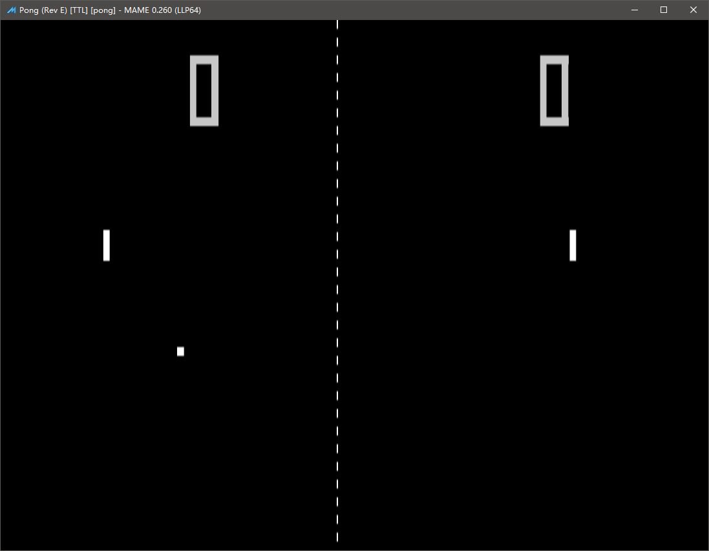

==========================================
运行
==========================================

准备好 JJui 程序
==========================================

准备好 JJui 程序，下载好程序。

压缩包 解压 到 某个 文件夹里。

　　
准备好 MAME 程序
==========================================

下载好 MAME 程序。

官网的 MAME 程序，是自解压程序，解压缩到 某个 文件夹里。

准备好 游戏列表 翻译文件
==========================================

翻译文件：``.jjui\translation.txt``，文本格式 字符编码为 utf-8 带 bom ( utf-8 没有 bom 也应该不影响读取内容)。

初始化时，会自动读取此文件的翻译。

初始化之后，如有变化，需要在菜单里，手动点击更新一下。

如果翻译放在别的文件中，也是可以的，游戏列表界面显示之后，需要在菜单里，手动点击选择文件并读取内容。

如果已经有了这个文件，可以用文本编辑器打开查看一下，看一看大致翻译了多少行内容。

我目前给 JJui 准备的翻译文件是一份非常老的文件，是从 MamePlus 源代码里 找出来的：
	https://github.com/svn2github/mameplus 
	
	（ 位置 mamep/makelang/text/mame_cn.lst ）

如果需要更新一下的话，可以去这里更新一下：
	http://www.ppxclub.com/609487-1-1
	
	https://www.ppxclub.com/forum.php?mod=viewthread&tid=609487

当然也可以自己手动修改

| 格式为：
| 每一行的开头为 游戏的 英文缩写；
| 之后，一个 制表符号 分隔一下；
| 之后，是翻译的内容；
| 如果之后，出现第二个 制表符号，此 制表符号 以及 后面的内容会被忽略，这个是为了兼容之前 MamePlus 源代码里面的原始文本格式。
| 不符合这种格式的行，会被忽略。

运行 JJui ,首先选择 MAME
==========================================

运行 JJui 。

一开始，需要选择 MAME 程序。

	不同版本呢，程序的文件名，可能不一样，一般是 mame.exe ，以前有 mame64.exe 等……

注：
	如果是在 U 盘上，所有关于 文件、文件夹 的路径 的设置项目，都需要用相对路径。
	
	因为每一次 U 盘 连接到电脑上，U 盘 所挂载的 盘符 可能会变。盘符不一样，绝对路径也就变了。

选择 MAME 之后，开始从 MAME 读取一些数据，用以显示游戏列表 等。

等一会，读取数据、解析数据，然后显示游戏列表：

.. image:: images/001_preview_1.png
   :alt: 此处应显示图片
   
   

下载游戏文件
==========================================

MAME 模拟器 的官方网站（ https://www.mamedev.org ），只有空的模拟器资源。并没有游戏文件资源。

所以，这方面，得自己找资源了。

如果仅测试的话
	好像 有个老古董游戏 pong 还是 pongd 来着，不需要下载游戏文件的，直接可以使用。
	
	官网上有几个老游戏（ https://www.mamedev.org/roms ），这里提供的数量太少了 并且 太古老了。

运行游戏
==========================================

在游戏列表中，选中一个游戏，鼠标双击，或者 按回车键，进入游戏。

	（得先下载好游戏文件。如果是新玩家的话，鼠标右击，弹出菜单，校验一下 roms ，校验结果正确再运行游戏）

进入游戏之前，会有一些提示。新版本的话，按任意键，就可以跳过提示信息了；但如果版本比较老，可能有的需要按回车键、有的需要顺序输入英文 OK 两个字母。

进入游戏后，按 Tab 键，弹出菜单，有一些选项。

在 Tab 菜单中，查看 此游戏的 默认 的 按键 设置情况。（也依据自己的喜好，修改按键设置）。

以前 在 古老的 街机厅 里 玩 实体的 街机，需要投币，在模拟器上，按 投币键 就可以了。

然后，开始 游戏 ……

MAME 模拟器 的设置
==========================================

JJui 只是 简单的调用 MAME 模拟器，目前，没有帮助模拟器修改设置的功能。

MAME 的设置，需要你回到 MAME 操作。

