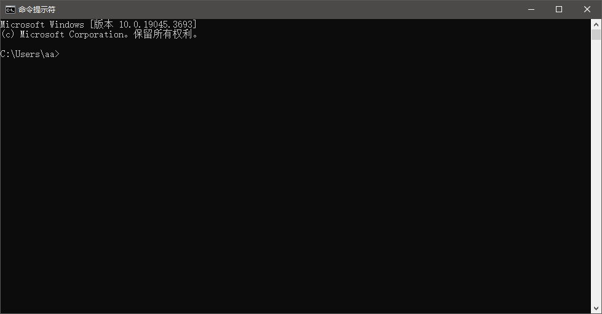

==========================================
命令行 CMD 运行 MAME 的游戏
==========================================

MAME 官网 发布的程序，好像都是 自解压 程序，随意 找个 文件夹 解压出来就可以用了。
不过不要找那种权限比较特殊的文件夹。

比如这里把 MAME 放在文件夹 ``D:\MAME\mame0260b_64bit`` 里，如下图，mame.exe 不是孤立的、单独的一个文件，除了它本身，还有其它许多的 文件/文件夹 在一起。

.. image:: images/folder.png
   :alt: 此处应显示图片

打开 CMD 命令行
==================

在 CMD 命令行中使用的话，我们打开 CMD 命令行，如下图：

进入 MAME 所在文件夹
=========================================

比如把 mame 程序，放在了 文件夹：``D:\MAME\mame0260b_64bit``

首先，命令行，需要进入 MAME 所在的文件夹。

指令为：
	
	::
		
		cd /d D:\MAME\mame0260b_64bit
	
	或者
	
	::
	
		D:
		cd D:\MAME\mame0260b_64bit

.. image:: images/cmd_cd.png
   :alt: 此处应显示图片

注::
	
	C:
		进入 C 盘
	D:
		进入 D 盘
	E:
		进入 E 盘
	……
		……等等，以此类推
	
	cd "文件夹路径"
		进入一个文件夹，需要在同一个驱动器中（比如都在C盘），
	
	cd /d "文件夹路径"
		进入一个文件夹（可以在不同的盘）
	
	cd
		显示当前目录
		  如上图中，每一行提示信息就是当前目录，
		  这种情况的，一直能看到当前目录，就不用特意去查看当前目录了
	
	cd ..
		转到 上一层目录
		  两个点，相对路径的表示方法，表示 上一层目录
	
	cd \
	cd /
		转到 根目录
		  我试了一下，两个方向的斜杠，好像都可以
	
	注意：
	如果文件夹路径中有 空格 以及其它特殊符号
	用 英文 双引号 包起来
		"D:\MAME\mame0260b_64bit"
	
	可以通过指令：
		help cd
		cd /?
		查看 cd 指令的帮助信息
	也可以网上搜索一下

查看 当前工作文件夹 路径
==============================

如上图，默认的情况，把所在文件夹都写提很清楚。不需要专门输入一条指令去查看。

如果遇到 CMD 被个性化设置修过，看不到 当前文件夹，这种情况，可以用 CD 指令（不加任何参数），查看一下 当前文件夹。

校验游戏文件的正确性
=============================

运行游戏之前呢，确认一下游戏文件有没有问题。
一般 第三方的 MAME ，或者，用 前端 配合 MAME 使用的话，这一个会简单一点。

比如游戏 pong （英文缩写，可以在游戏列表中查看到）。
这个游戏，在当前的 MAME 版本，其实 不需要任何的游戏文件。
不过这里展示一下过程。
指令如下::
	
	.\mame.exe -verifyroms pong

注::
	
	一个点表示 当前文件夹，可以省略
		mame.exe -verifyroms pong
	
	mame.exe 也可以省略扩展名 .exe
		.\mame -verifyroms pong
		或
		mame -verifyroms pong
		
		如果有同名的 mame.exe 、mame.bat 、mame.com ……等可以运行的程序、脚本在一起，
		就不要省略 扩展名，免得分不清楚

运行 游戏
===========================

比如运行 游戏 pong 。
	
	命令行中，运行的游戏名使用的是英文缩写，
	游戏的英文缩写是什么，
	可以在游戏列表界面中查看。

指令为::
	
	.\mame.exe pong

一个点表示 当前文件夹，可以省略::
	
	mame.exe pong

也可以省略扩展名 .exe::
	
	.\mame pong
	或
	mame pong
	
	如果有同名的 mame.exe 、mame.bat 、mame.com ……等可以运行的程序、脚本在一起，
	就不要省略 扩展名，免得分不清楚

其它::
	
	运行街机游戏的命令行指令的一般格式为：
	
	.\mame.exe   街机游戏名英文缩写   如果有其它更多选项写在后面
	
	如果有其它参数，可以写在指令的后面。
	
	但一般没有必要，各种选项参数，可以提前设置好。
	
	更多内容可以参考 MAME 的 说明文档。
	
	官方原版 MAME 的 说明文档，是以命令行的方式介绍的，看到了命令行指令，不要觉得奇怪。