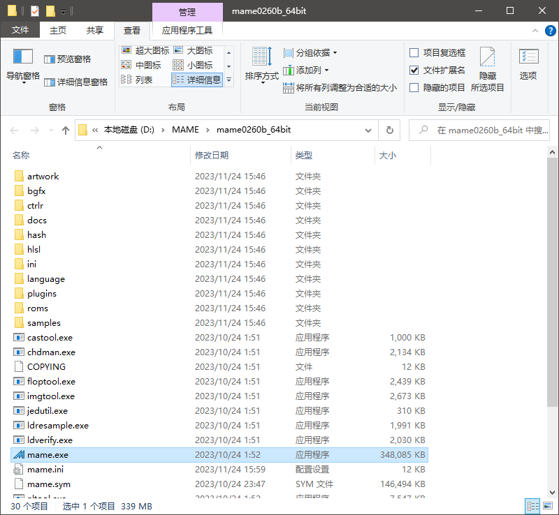
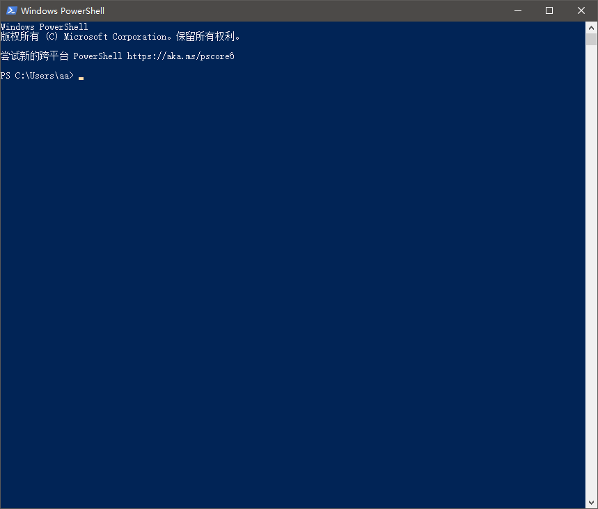
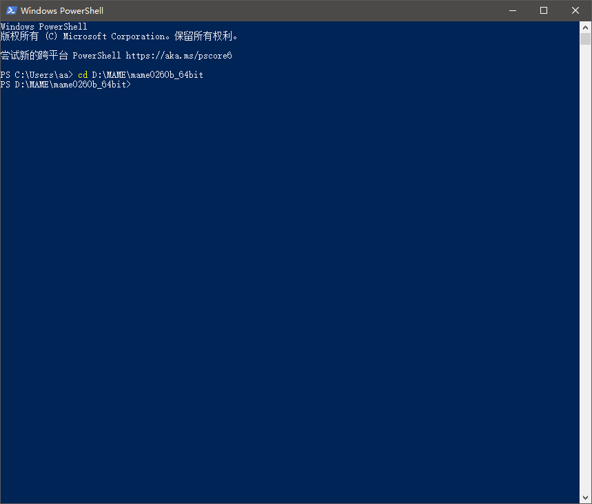
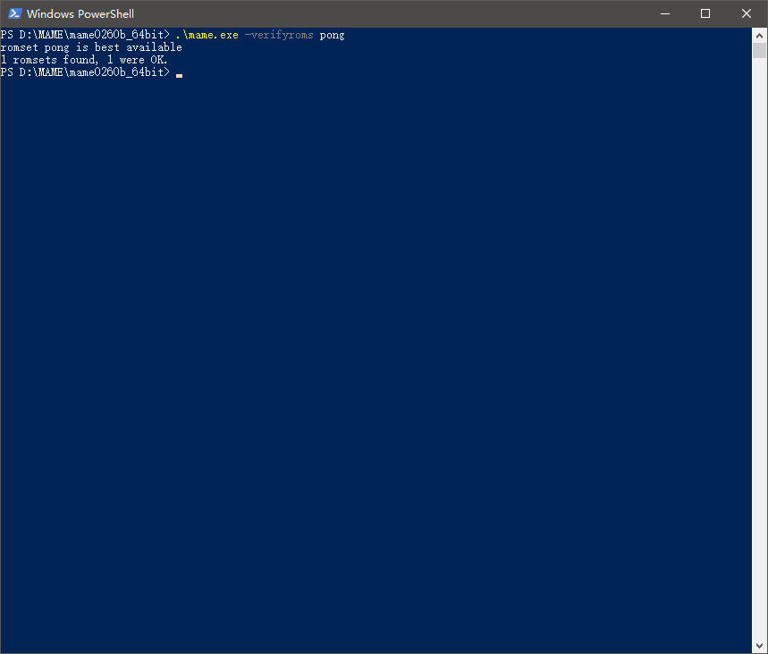
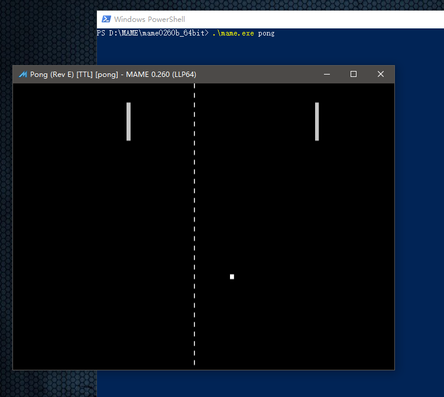

==========================================
命令行 PowerShell 运行 MAME 的游戏
==========================================

MAME 官网 发布的程序，好像都是 自解压 程序，随意 找个 文件夹 解压出来就可以用了。
不过不要找那种权限比较特殊的文件夹。

比如这里把 MAME 放在文件夹 ``D:\MAME\mame0260b_64bit`` 里，如下图，mame.exe 不是孤立的、单独的一个文件，除了它本身，还有其它许多的 文件/文件夹 在一起。

打开 PowerShell 命令行
==========================

在 PowerShell 命令行中使用的话，我们打开 PowerShell 命令行，如下图：

进入 MAME 所在文件夹
=========================================

比如把 mame 程序，放在了 文件夹：``D:\MAME\mame0260b_64bit``

首先，命令行，需要进入 MAME 所在的文件夹。

指令为：
	
	::
		
		Set-Location D:\MAME\mame0260b_64bit
		
		或者 ：
		
		cd D:\MAME\mame0260b_64bit

注::
	
	CD 指令 是 Set-Location 别名，一样可以用，和 CMD 中的 CD 指令的用法 差不多
	help Set-Location 或者 help cd 查询一下帮助，或网上搜一下
	
	注意：
	如果文件夹路径中有 空格 以及其它特殊符号
	可能要用 英文 包起来
		'mame0260b_64bit'
		'd:\MAME\mame0260b_64bit'
	PowerShell 双引号 字符串 可能产生一些变量转义之类的
	用单引号

查看 当前工作文件夹 路径
==============================

如上图，默认的情况，把所在文件夹都写提很清楚。不需要专门输入一条指令去查看。

如果遇到 PowerShell 被个性化设置修过，看不到 当前文件夹，这种情况，可以用  Get-Location 指令 (或 它的别名 pwd 指令)，查看一下 当前文件夹。

校验游戏文件的正确性
=============================

运行游戏之前呢，确认一下游戏文件有没有问题。
一般 第三方的 MAME ，或者，用 前端 配合 MAME 使用的话，这一个会简单一点。

比如游戏 pong （英文缩写，可以在游戏列表中查看到）。
这个游戏，在当前的 MAME 版本，其实 不需要任何的游戏文件。
不过这里展示一下过程。
指令如下::
	
	.\mame.exe -verifyroms pong

注::
	
	注意一个点表示 当前文件夹，不能省略。
	不像 CMD 命令行可以省略。
	
	也可以省略扩展名 .exe
		.\mame -verifyroms pong
		
		如果有同名的 mame.exe 、mame.bat 、mame.com ……等可以运行的程序、脚本在一起，
		就不要省略 扩展名，免得分不清楚

运行 游戏
===========================

比如运行 游戏 pong 。
	
	命令行中，运行的游戏名使用的是英文缩写，
	游戏的英文缩写是什么，
	可以在游戏列表界面中查看。

指令为::
	
	.\mame.exe pong

可以省略扩展名 .exe::
	
	.\mame pong
	
	如果有同名的 mame.exe 、mame.bat 、mame.com ……等可以运行的程序、脚本在一起，
	就不要省略 扩展名，免得分不清楚

注::
	
	注意一个点表示 当前文件夹，不能省略。
	不像 CMD 命令行可以省略。

其它::
	
	运行街机游戏的命令行指令的一般格式为：
	
	.\mame.exe   街机游戏名英文缩写   如果有其它更多选项写在后面
	
	如果有其它参数，可以写在指令的后面。
	
	但一般没有必要，各种选项参数，可以提前设置好。
	
	更多内容可以参考 MAME 的 说明文档。
	
	官方原版 MAME 的 说明文档，是以命令行的方式介绍的，看到了命令行指令，不要觉得奇怪。