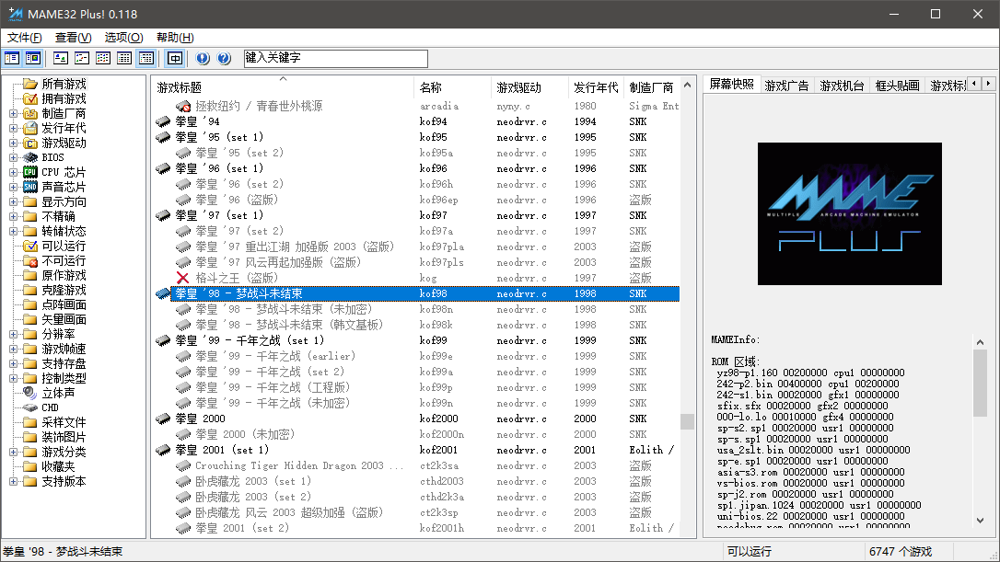
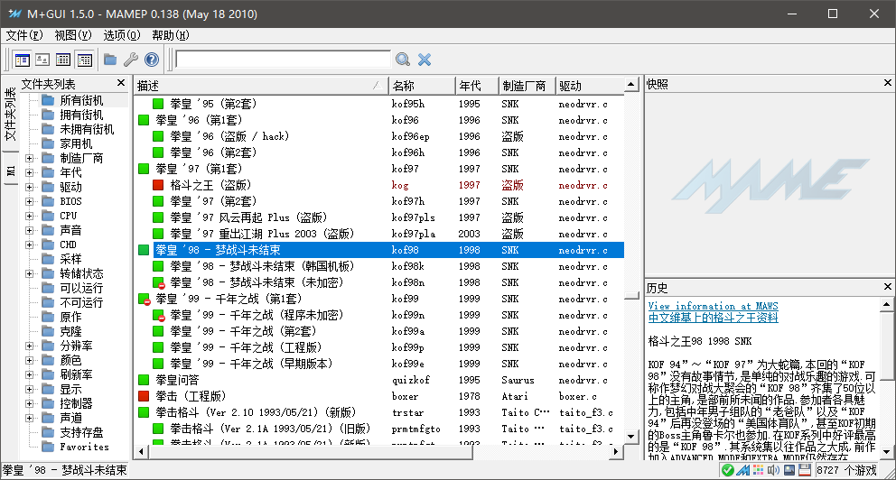
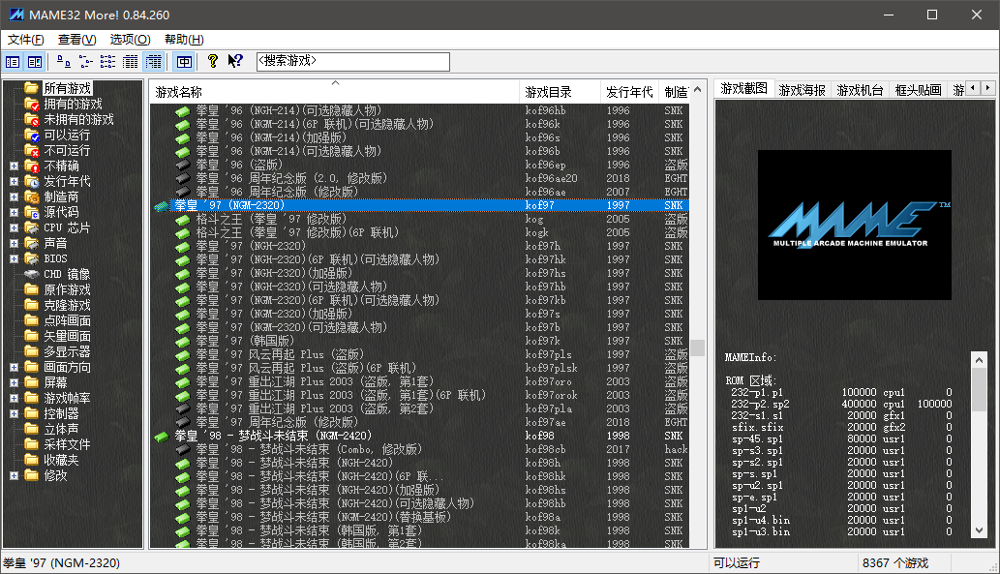
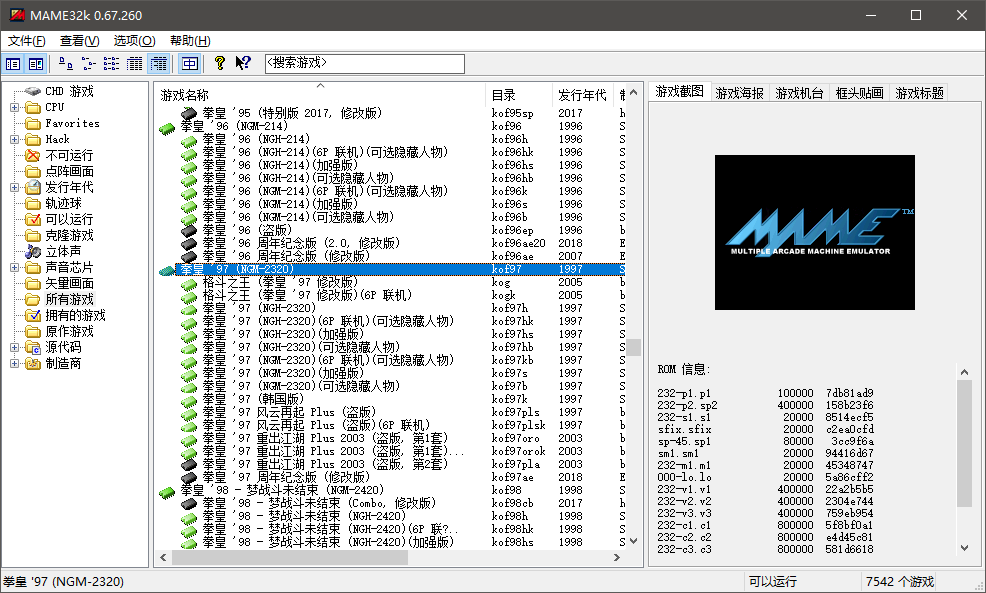
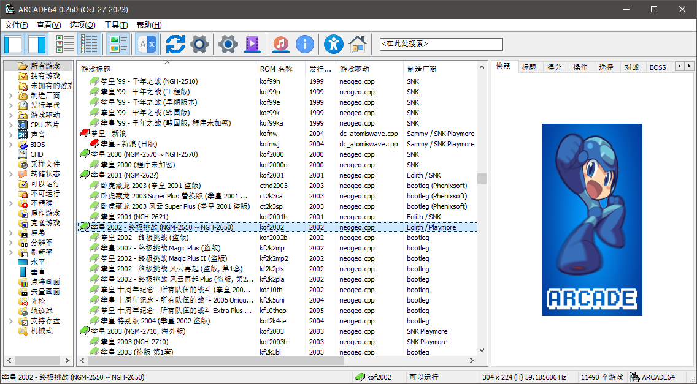

=======================================
支持中文的 第三方 MAME
=======================================

因为 MAME 源代码是开放的，所以有很多 第三方 的版本。

官方 原版 MAME 0.171 版开始，选项菜单可以选择使用中文。

官方 原版 MAME 0.237 版开始，游戏列表可以选择使用中文。
	
	不过，它这个游戏列表的界面，仍然还是很简陋

早期版本的话，官方原版虽然不能用中文，但其它的 第三方的 版本，有一些是可以方便使用中文的。

MamePlus
================

MamePlus 到 0.168 版后，停止更新了。
	
	后期的一些版本 bug 也可能比较多

支持多种语言，包括简体中文、繁体中文。

下面这样的是 MamePlus 0.118 版 游戏列表 界面的截图

下面这样的是 MamePlus 0.138 版 游戏列表 界面的截图
	
	独立的 M+GUI 前端，配合 命令行版本 使用
	
	所以下图中，标题栏首先显示的 M+GUI 的版本，然后显示 MamePlus 的版本。
	
	游戏列表 在 M+GUI 前端 中 显示
	
	运行 游戏时 M+GUI 调用 MamePlus 程序 运行游戏
	

MamePlus ，在之后，到 0.168 版，然后停止更新了。
	
	失效的网址：
	
		| http://mameicons.free.fr/mame32p/
		| 这个网址消失得很早
		| 如果查看 M+GUI 帮助 关于，可能会看到这个网址，但早已失效
	
	这里估计也可能失效了：
	
		http://sourceforge.net/projects/mameplus
	
	这里有一系列备份，不过语言包不一定全：
	
		http://www.progettosnaps.net/mameplus/
	
	PPXCLUB 论坛 kof2112 编译的版本 到 0.168：
	
		https://www.ppxclub.com/601010-1-1
　　　
mame32m 、mame32k
===================================

mame32m 、mame32k 很早就停止更新了。

这两款是可以 使用 kaillera 联机插件的。

ppxclub 论坛的 Creamymami ，一直有对这两款模拟器有更新
	
	https://www.ppxclub.com/1287-1-1
	
	不过更新的可能只是一部分
	
	mame32m 的核心版本好像是 0.84
	
	mame32k 的核心版本好像是 0.67
	
	核心版本比较老的话，如果有兴趣，可以先测试一下，在自己电脑上有没有兼容性问题。
	没问题的话，也是可以用的。
	
	老版本的话，占用的电脑资源更少。

如下图，标题栏显示 mame32m 的版本显示为 0.84.260
	
	0.84 的意思，大概就是 核心的版本 是 基于 0.84 版的，非常老的版本
	
	.260 的意思，大概就是 有一部分内容，更新同步到 0.260 版

mame32k

Arcade
=======================

Arcade 本身是 英文版的。最近的话，好像一直有大佬出汉化的版本。

Arcade 是第三方的 MAME ，清爽版，删除了 很多不能运行的游戏、家用机游戏、…… 等。

https://arcade.mameworld.info/

| 如果有 PPXCLUB 帐号的话
| 搜索一下，比如 当前 0.260 版
| 找到了到两个 汉化 的版本：
| 一个是 kof2112 汉化的 https://www.ppxclub.com/forum.php?mod=viewthread&tid=710430
| 另一个是 lineay 汉化的 https://www.ppxclub.com/forum.php?mod=viewthread&tid=717706

HBMAME
=========================

HBMAME 本身是英文版的。最近的话，好像一直有大佬出汉化的版本。

HBMAME 是第三方的 MAME 。主要是收录很多民间高手修改的版本。

HBMAME 现在核心版本，貌似停留在 MAME 0.245 了。

| 民间高手修改的版本，乱七八糟的，有点太杂。
| 只收了游戏，没有相关文字内容的记录，不知道某一款到底修改了什么内容。
| 可以从游戏的名称猜一下是什么情况。

http://hbmame.1emulation.com/index.html

lineay 汉化的 ： https://www.ppxclub.com/forum.php?mod=viewthread&tid=717820

其它的
===========

RetroArch
	
	| http://www.retroarch.com/ 
	| 这个不是以 MAME 为主体的
	| RetroArch 这东西的话，是大杂烩，收录各种各样的模拟器，也包括 街机类 MAME 核心 、街机类 FBNeo 核心
	| 电脑上 MAME ，不推荐用 RetroArch ，电脑上用 原始版本的 MAME 、第三方 MAME 就行了
	| 如果不在电脑上，比如在手机上，我不太了解，你可以试试
	| 那说到中文的话，这东西我不太了解，就不说了，你可以去找找 RetroArch 使用说明

其它的我不太了解的估计也会有。而且估计有很多。

不了解的，就不多说了。
