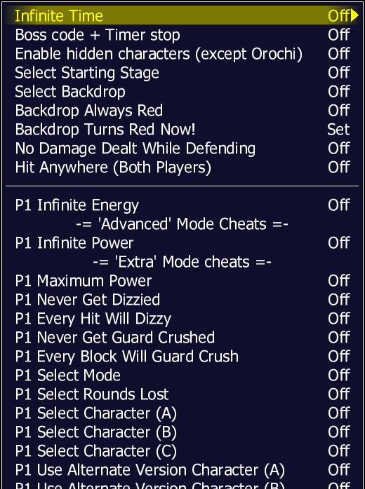

====================================
cheat 作弊码
====================================

下载作弊码
===============

Pugsy's cheats
	http://www.mamecheat.co.uk
	
	主要的是这个，作弊码非常的多。

Wayder
	http://nekoziman.s601.xrea.com/cheat/
	
	这一款作弊码可以为补充

两款作弊码，稍微设置一下，就可以同时使用。

如果需要中文版本的作弊码，可以多关注一下 街机模拟器 相关的网站、论坛，
偶尔会有大佬翻译一下。

文件格式
=========================================

新版本
	
	默认文件名为：cheat.7z 或者 cheat.zip
	
	默认的存放位置为 模拟器 相同的文件夹。
	
	使用的时候，可以直接使用压缩包，不用解压。
		
		其实解压也可以，解压缩到 同名 的文件夹中。
	
	注意：
		
		资源为了节约体积，可能使用多层压缩。
		如果是多重压缩的，不能用，要先解压为单层的压缩包。
	
	.7z 和 .zip 都是压缩包文件，只是格式不同。
	以前的一些版本用的 .zip ，
	现在 Pugsy 的作弊码，都喜欢用 .7z 格式的了。
	
	cheat.7z （或者 cheat.zip ）内部，主要是 .xml 文件。
	
	街机：
		
		作弊码文件名，和街机游戏的英文缩写一一对应。
		比如 cheat.7z 中的 kof97.xml 是 街机 kof97 的 作弊码。
	
	非街机：
		
		每一类作弊码放在一个子文件夹里的，文件夹名 与 hash\\*.xml 文件名对应；
		子文件夹中，作弊码文件名 与 此类游戏的 英文名缩写 对应。
		比如 cheat.7z 中的 nes/sbm1.xml 对应于 hash\\nes.xml 中记录的游戏 smb1 。
	

老版本
	
	默认文件名为 cheat.dat
	
	默认的存放位置为 模拟器 相同的文件夹
	
	0.126 以及之前的版本，是这种格式的。
	
	cheat.dat 可以用文本编辑器 打开查看。

开启作弊功能
========================

下载 Pugsy 作弊码 cheat.7z ，默认的存放位置在 mame.exe 相同的文件夹。

MAME 默认没有开启作弊功能的。打开 MAME ，找一找 开启作弊码功能 的选项，开启就是了。

如果手动设置的话，对应于 mame.ini 配置文件中的 cheat 这一项
	
	原来为::
		
		cheat                     0
	
	改为::
		
		cheat                     1

开启作弊功能以后，进入一个常见的游戏，比如 kof97 ，
按 Tab 菜单弹出菜单，菜单中多出了一个 作弊码 的选项，
如下图：

进入下一层子菜单，就可以看到具体的作弊码的各种作弊选项了，如下图：

两份作弊码同时使用
=============================

首上前面说的作弊码功能的开关，要打开。

比如第一份作弊码：cheat.7z

比如第二份作弊码：cheat_wayder.7z

比如我们把两份作弊码文件同时放在 模拟器相同的文件夹 中。

两份作弊码同时使用：
	
	MAME 模拟器中，设置里找一找，路径设置的选项，作弊码的路径，原来为 cheat ，添加一个 cheat_wayder 就可以了。
	
	如果手动设置的话，对应于 mame.ini 配置文件中的 cheatpath 这一项
		
		原来为::
			
			cheatpath                 cheat
	
		改为（英文分号间隔一下）::
			
			cheatpath                 cheat;cheat_wayder

完了以后，找个游戏对比一下：
	
	比如 kof97 使用一个作弊码时，最后一项为 Infinite Credits ：
		
		.. image:: images/cheat_multi_1.png
	
	使用两组作弊码后，后面多出来了一些：
		
		.. image:: images/cheat_multi_2.png

插件 作弊相关
========================

比如 0.260 版本。

打开插件功能 总开关。

插件各功能中有两个和作弊有关的： cheat 、 cheatfind ，打开。

进入游戏，比如 kof97 ，按 Tab 键，弹出菜单，有【插件】这一项，如下图：	
	
	.. image:: images/cheat_plugin_1.png

进入【插件】后，看到我们打开的两个项目，cheat（作弊） 、cheatfind（作弊查找）：
	
	.. image:: images/cheat_plugin_2.png

其中的 cheatfind（作弊查找）这个选项，不了解，感兴趣的可以试试。

另一个选项 cheat（作弊）。
	
	第一：
		
		打开一看，和前面说的作弊码功能重复了？
		
		确实有点重复了。
		不过，菜单最后面，有一个【设定热键】的选项，如下图：
			
			.. image:: images/cheat_plugin_3.png
		
		
		这个【设定热键】选项，
		是原作弊功能中没有的，
		如果有高频使用的作弊码功能，可以设置一个热键，开启关闭更方便。
	
	第二：
		
		仔细看 作弊码 压缩包 cheat.7z 中，除了有很多 ``*.xml`` 文件，
		还有少量的 ``*.json`` 文件
			
			比如就有 sf2.json 文件
			
			看了一下游戏 sf2 ，插件的作弊 比 原始的作弊 多出了第一项 【Hitbox viewer】，如下图
				
				.. image:: images/cheat_plugin_hitbox.png
				   :alt: 此处应显示图片
