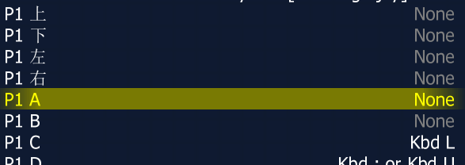
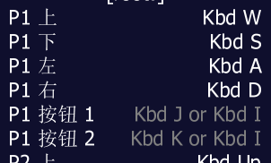
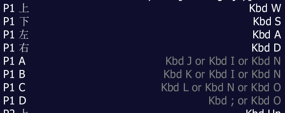
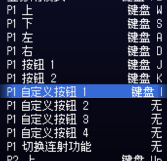
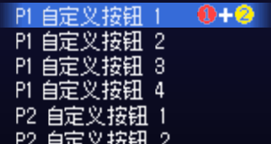
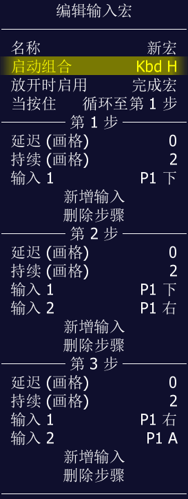
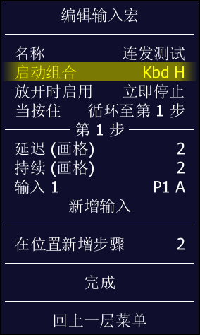
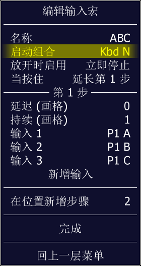

==================================================
按键设置
==================================================

进入游戏以后，按 Tab 键，弹出菜单，找到 按键设置 的选项。

0.260 版本，如下两图：
	
	菜单第一项就是的
	
		.. image:: images/key_tab_1.png
	
	进入以后，显示子菜单
	
		.. image:: images/key_tab_2.png

不同版本，可能 菜单选项位置略有不同。

按键设置 有 全体游戏按键设置 、 当前游戏按键设置 两部分。

新用户，可以先 看一下 了解一下 默认的按键设置是怎样的。

新用户，学习修改按键的话，可以先在 当前游戏按键设置 里试一试。熟悉了以后，再去 全体游戏按键设置 试一试。

按键设置 的 相关参数，默认会保存在 cfg 文件夹里。

如果觉得 按键设置 需要重新开始的话，可以清空一下 cfg 文件夹。

友情提示：
	
	| 全体游戏按键 设置 时，将 玩家1 、玩家2 都设置一下
	| 即使电脑上可能只有自己一个人在玩
	| 有些游戏（比如 Vs. Battle City / Vs. 坦克大战），一个人玩时，玩家2的也可以控制的
	| 这时，如果玩家2的按键没去管过，很容易错按到

注：
	
	小键盘用户的话：小键盘比较节省空间，但，可能键盘上的按键不全

默认值 快捷键
===========================

新户用的话，可以在 全局按键设置 选项里 查看了解一下，有些不明白的，可以去看看官方的（英文）说明文档，更详细。

模拟器功能的一些快捷键，默认情况::
	
	游戏中：
		
		Tab 键： 弹出 菜单 / 隐藏 菜单
	
	游戏中，菜单显示时：
		
		Tab 键： 隐藏 菜单
		
		回车键：确定
		
		Esc 键：回到菜单的上一层；取消选项
		
		方向键 上 ↑：上下左右选择
		方向键 下 ↓：上下左右选择
		方向键 左 ←：上下左右选择
		方向键 右 →：上下左右选择
		
		PageUp 键，菜单向上翻一页
		PageDown 键，菜单向下翻一页
		Home 键，菜单跳到最上方
		End 键，菜单跳到最下方
		
		Delete 键：
		   按键设置时、作弊选项时、插件选项时：清除/重置
		
		…… 等等
	
	游戏中，正常游戏未显示菜单时：
		
		Tab 键： 弹出 菜单
		
		Esc 键： 退出游戏
		  可以开启确认功能：退出游戏时，需要确认
		  免得一不小心按错就退了
		
		Alt + Enter（回车键）：切换 全屏/窗口
		老版本 左Alt + Enter（回车键）
		
		P 键： 游戏暂停
		
		~ ：（Tab键上面的那个按键）显示/隐藏 调节声音大小的进度条
		
		Shift + F7
		  游戏存档，然后选择存档位置
		  存档位置 可以用 英文字母键、主键盘上的数字键
		F7
		  游戏读档，然后选择位置（存档时用的那个位置）
		
		F3：游戏重启(软重启）
		Shift + F3：游戏重启(彻底重启）
		老版本 左Shift + F3
		
		F11 ：显示游戏速度
		Insert 键：按住此键不放时，游戏加速
		F8 键、F9 键、F10 键：会改变游戏速度
		F8: Decrease frame skipping on the fly.跳帧减少
		F9: Increase frame skipping on the fly.跳帧增加
		F10: Toggle speed throttling.速度调节
		（ 存档、读档 用到的 F7 键 ，容易 碰到 F8 等，改变游戏速度
		（ 如果觉得碍事，可以选择删除掉
		
		F12：游戏截图
		截图默认保存位置为 snap 文件夹
		
		ScrollLock 键：
		  街机部分，应该用不到这个
		  MESS 部分，有些模拟的设备也需要用到键盘
		  此时，Scroll Lock 键，切换 键盘 所属 状态
		  1，键盘给模拟器用，比如按 Tab 键，弹出菜单/隐藏菜单
		  2，键盘给模拟出来的设备使用
		
		F6 ：作弊功能 开启/关闭
		
		…… 等等

默认值 游戏按键
=======================

整体游戏按键，默认情况 ::
	
	主键盘 数字键 5 ：玩家1投币
	主键盘 数字键 6 ：玩家2投币
	主键盘 数字键 7 ：玩家3投币
	主键盘 数字键 8 ：玩家4投币
	
	主键盘 数字键 1 ：玩家1开始键
	主键盘 数字键 2 ：玩家2开始键
	主键盘 数字键 3 ：玩家3开始键
	主键盘 数字键 4 ：玩家4开始键
	
	F2 ：
	  有些游戏按此键进入设置界面
	  pgm 游戏(三国战纪、西游释厄传 等)，按 F2，再按 F3 重启一下
	
	我个人觉得 默认的 游戏的按键的设置 可能不是很友好，需要修改一下，按起来才顺手。
	
	我觉得不顺手，其它的就不提了，估计你大概率也要修改一下

按键设置 关闭一个键
======================

选中要修改的按键，按 Delete 键，显示结果“None”（，再按 Delete 键 ，会重置选项。）

以前版本的话，按 Esc 键也是可以的：
	
	选中要修改的按键，按回车键后，按 Esc 键，显示结果“None”
	
	0.260 版本，我试了一下，这样操作，不可以了
	
	后续还要关注一下，不知道以后是不是一直这样了

按键设置 重置一个键
=======================

上面删除一个键用的 Delete 键，

重置一个键，也用的 Delete 键，

选中要修改的按键，按 Delete 键，显示结果如果是 “None” 表示被删除了，再按一次 Delete 键，看看显示结果有没有变回来。

按键设置 修改
==================

比如 设置为 A ：
	
	选中要修改的按键，按回车键后，按 A 键，显示结果为 “Kbd A” 
	
	Kbd，应该是 指 keyboard ，键盘
	
	不同版本中，可能显示的略有差异
	
	.. image:: images/key_a.png

按键设置 ，组合键，or
=================================

| 此处介绍一下 组合键 的设置
| 后面 宏功能 的说明 中，也有示例怎样在 宏功能 中设置 组合键

将多个键，设置到一个功能上。设置 完成后，显示的结果为：某个键 or 另一个键 or ...

比如两个键的游戏::
	
	如下图，是两个键的游戏：P1 除了方向上下左右，还有 P1 按钮 1 、P1 按钮 2
	
	注：P1 表示 玩家 1
	
	两个键的游戏：用 J 和 K 两个键，简单设置就行了。
	但这里再设置一个 I 键，当组合键，相当于两个键一起按。
	
	可以这样设置：
	
	选中 P1 按钮 1
	按回车键
	按 J 键
	完成后
	再按回车键
	按 I 键
	此时显示的结果是： J or I
	
	选中 P1 按钮 2
	按回车键
	按 K 键
	完成后
	再按回车键
	按 I 键
	此时显示的结果是： K or I
	
	此时 J 键，作用于 P1 按钮 1
	此时 K 键，作用于 P1 按钮 2
	此时 I 键，同时作用于 P1 按钮 1 、P1 按钮 2
	
	如下图：

完成了。

再看一下 《拳皇97》，设置了三个组合键，如下图::
	
	J 键，作用于 P1 A ，轻拳
	K 键，作用于 P1 B ，轻脚
	L 键，作用于 P1 C ，重拳
	; 键，作用于 P1 D ，重脚
	I 键，组合键，同时作用于 A+B , 地上打滚闪身
	O 键，组合键，同时作用于 C+D , 超重击
	N 键，组合键，同时作用于 A+B+C , 有能量时 爆气

补充 MamePlus 组合键
==========================

注：官方原版 MAME 的操作方式不同。

| 这里提一下 MamePlus 的 另外一种 设置组合键的方法。
| 这种方法不是 官方原版 MAME 的功能。
| 其它的一些第三方的 MAME 也可能会添加这样的功能。
| 如果使用 MamePlus 等模拟器，可以像官方原版 MAME 一样的设置，也可以用下面说的这种方法。

操作：

| 比如两个键的游戏，原来 设定的 J 键、K 键。
| 现在想添加一个 I 键 当组合键，相当于 两个键 一起按。

第一步：在 当前游戏 按键设置 的地方，P1 自定义按钮 1，设为 I 键，如下图。 

第二步：
	
	| Tab 菜单
	| → 自定义按钮
	| → 找到对应的 P1 自定义按钮 1
	| → 按主键盘上的数字键 1 、2 、3 、4 、5 、…… 调节 想要的组合
	| 比如 按1 会显示 1 ，再按一次 会取消
	| 这里 两个键的组合 按成  1+2 如下图的效果就行了

完成了。

再看一下 《拳皇97》，设置了三个组合键，如下图:
	
	::
		
		J 键，作用于 P1 按钮1 ，轻拳
		K 键，作用于 P1 按钮2 ，轻脚
		L 键，作用于 P1 按钮3 ，重拳
		; 键，作用于 P1 按钮4 ，重脚
		I 键，组合键，同时作用于 1+2 , 地上打滚闪身
		O 键，组合键，同时作用于 3+4 , 超重击
		N 键，组合键，同时作用于 1+2+3 , 有能量时 爆气
	
	当前游戏 按键设置 的地方：
	
	.. image:: images/key_mamep_3.png
	
	| 
	| 自定义按钮 的地方：
	
	.. image:: images/key_mamep_4.png

按键设置 ，and ，没什么用
=================================

多个键一起按，才能起作用。

| 模拟器的功能，一些快捷键，是这样子的。
| 比如 游戏中 默认 按 Alt + 回车键，可以切换 全屏模式、窗口模式。
| 比如 游戏中 默认 按 Shift + F7 ，存档。

个人觉得，游戏中，完全不需要这种。

操作：
	
	比如我们想设置 A 键、B 键 一起按，才能起作用。
	
	| 选中要修改的按键
	| 按回车键后
	| 按 A 键 （节奏要快一点，慢了就结束了）
	| 按 B 键 （节奏要快一点，慢了就结束了）
	| 完成
	| 结果显示 Kbd A Kbd B
	| 如下图
	| 注：and 不显示在结果中；之前说的 or 、下面会说的 not，会显示出来
	
	.. image:: images/key_and.png

按键设置 ，not ，没什么用
===============================

表示不按某个键。

| 模拟器的功能，一些快捷键，默认的设置，有许多是这样子的。
| 比如 
| Shift + F3 ，彻底重启
| F3 ，软重启（ 就是 F3 not Shift not 右Shift ）

游戏中，应该用不到这种。

操作：
	
	比如我们想设置 按 A键 ，但是强调一下不按 B键 。
	
	| 选中要修改的按键
	| 按回车键后
	| 按 A 键 （节奏要快一点，慢了就结束了）
	| 按 B 键 （节奏要快一点，慢了就结束了）
	| 按 B 键 ，按第二次会出现 not（节奏要快一点，慢了就结束了）
	| 完成
	| 结果显示 Kbd A not Kbd B
	| 如下图
	
	.. image:: images/key_not.png

按键设置 全体游戏按键设置
================================

友情提示：
	
	| 设置按键时，将 玩家1 、玩家2 都设置一下
	| 即使电脑上可能只有自己一个人在玩
	| 有些游戏（比如 Vs. Battle City / Vs. 坦克大战），一个人玩时，玩家2的也可以控制的
	| 这时，如果玩家2的按键没去管过，很容易错按到

MAME 模拟各种类型的街机游戏。

这里主要就说一下，以前街机厅里常见的那种：一个大摇杆，另外有几个按键的这种类型。

就单这一种（大摇杆 + 几个按键）类型的话，还是挺简单的。

全体游戏按键设置中，现在都是分类的，玩家1、玩家2、…… 是分开来的。（如果是特别老的版本，有可能是混在一起的）

如下，看一下 玩家1 的设置：
	
	| 玩家1 投币键：主键盘数字5
	| 玩家1 开始键：主键盘数字1
		
		这两个默认的挺好，不用改
	
	| P1 上：
	| P1 下：
	| P1 左：
	| P1 右：
		
		| 这四个方向，表示大摇杆的方向，根据个人喜好设置方向键就是了
		| 那大摇杆不是 还有 右上、右下、左上、左下 四个斜方向吗？
		| 比如：右下方 这个方向，其实是碰到了 右方向、下方向 两个方向键。
	
	| P1 按钮 1 ：
	| P1 按钮 2 ：
	| P1 按钮 3 ：
	| P1 按钮 4 ：
	| P1 按钮 5 ：
	| P1 按钮 6 ：
		
		| 比如《圆桌骑士》用前两个 键
		| 比如《拳皇97》用前四个 键
		| 比如《街头霸王 2》用前六个 键
		| 这些按键呢，根据个人喜好设置一下就是了
		| 全局设置完了，到具体游戏时可能还需要微调
	
	| 玩家1，其它的键，还有好多好多 其它类型的。
	| 其它类型的，这里就不提了。
	| 大摇杆 + 几个按键，这种，是最常见的。
	
	如下图：
	
	.. image:: images/key_all_p1.png

如下，看一下 玩家2 的设置：
	
	| 玩家2 投币键：主键盘数字6
	| 玩家2 开始键：主键盘数字2
		
		这两个默认的挺好，不用改
	
	其它的和上面 玩家1 类似，把需要的键，改到自己喜欢的位置，如下图：
	
	.. image:: images/key_all_p2.png

连发
============

| 此处介绍一下 插件功能 中的 连发功能。
| 后面 宏功能 的说明 中，也有示例怎样在 宏功能 中设置 连发。

| 注：
|   如果用的是第三方的 MamePlus ，它的 Tab 菜单中，就有一个 【连射设置】 的选项，要简单一些。
|   我们这里说的是 官方原版 MAME 的设置方式。

官方原版 MAME 的话：
	
	早期的版本 好像是没有 连发 功能的
	
	有一段时间（记不清楚具体哪些个版本了），（需要开启作敝功能）在 作弊功能 的第一项
	
	现在，连发功能在插件中，这个应该是从 0.216 版本 开始的

比如 0.260 版，这功能在 插件 中
	
	运行游戏之前，检查一下：
		
		| 插件 总开关要打开（默认好像就是打开的）
		| 插件 中 有各种功能，其中的 连发(autofire)功能 要打开
	
	运行游戏，游戏中
		
		| 按 Tab ，弹出 菜单
		| 选【插件选项 Plugin Options】
		| 进入下一层菜单
		| 选【连发 Autofire】
		| 你可以新增一个条目，并编辑一下，编辑好了记得保存
		
		比如 合金弹头2 ：
			
			| 玩家1， P1 A 是 射击键，选择设置 P1 A
			| 把 这个 连发 设在键盘的 U键 上
			| 速度是：
			| 	每次按住此键的时间 2帧
			| 	每次松开此键的时间 2帧
			| 	（时间可以自己调节）
			| 如下图
			
			.. image:: images/plugin_autofire.png

宏 （一键出招）
=====================

这个功能应该是从 0.237 版本开始的。

比如 0.260 版，这功能在 插件 中
	
	运行游戏之前，检查一下：
		
		| 插件 总开关要打开（默认好像就是打开的）
		| 插件 中 有各种功能，其中的 宏(input macros)功能 要打开
	
	运行游戏，游戏中
		
		| 按 Tab ，弹出 菜单
		| 选【插件选项 Plugin Options】
		| 进入下一层菜单
		| 选【宏 Input Macros】
		| 你可以新增一个条目，并编辑一下，记得保存

一键出招
----------

| 《拳皇97》
| 玩家1，八神，在左边，发波，做个宏，设在键盘 H键 上
| 指令为 ↓↘→A ，
|   分成三部分：↓ , ↘ , →A
|   时间为： 2帧，2帧，2帧
|   当按住时，完成宏 （免得松手时，招还没出完）
| 如下图
|   图中的 “画格” 应该翻译为 帧

用 宏 设置连发
------------------

| 《合金弹头2》
| 玩家1，给 P1 A 做个连发功能，设在键盘 H键 上
|  连发时，每次按键的时间为 2帧
|  连发时，每次松开按键的时间为 2帧
|  当按住时，循环
| 如下图
|   图中的 “画格” 应该翻译为 帧

用 宏 设置组合键
--------------------

| 《拳皇97》
| 玩家1，A+B+C 
|   ADVANCED 模式，有能量时，爆气，
|   EXTRA 模式，可以 畜能量
|   把这个组合键设到键盘上的 N键 上
| 设置如下
|   组合键有三个：P1 A、P1 B、P1 C 
|   时间设为 1帧
|   当按住时，延长第一步 ( 这样，按时间长短，都可以 )
| 如下图
|   图中的 “画格” 应该翻译为 帧

多个键盘一起使用
=====================

先插好键盘，然后打开 MAME 。

| 如果是键盘用户，并且，有 两个人 或者 更多人，一起玩游戏。
| 如果喜欢用键盘，可以开启 多键盘 功能。
| 每个人用不同的键盘，互不影响。

默认多键盘功能可能没有开启，进入游戏之前，设置选项里打开一下。

打开 MAME ，在游戏列表界面，选项里找一找，找到 多键盘功能，开启。

或者，配置文件 mame.ini 中，找到 multikeyboard 这一行，把值改为 1 就行。 ::
	
	multikeyboard             1

开启这功能之后，

进入游戏，

这时，你需要试一下哪一个是主键盘，

游戏中，在主键盘上 按 Tab 键，弹出菜单，重新设置一下按键，把 按键 设置在 不同的键盘上。

然后，……

键盘 按键冲突
================

| 键盘用来打字、办公的话，和玩游戏不同。
| 组合键可能会用到的，Shift、Alt、Ctrl、Win ，应该不会有按键冲突。
| 其它的键，应该很少一起键。
| 
| 玩游戏，就不一样了，在同一时间，可能需要按好多个键。

| 当多个键一起按的时候，可能会出现 按键冲突。
| 正常现象，很多键盘都有 按键冲突。

| 你可以试试自己的键盘，看看有没有问题。
| 如果觉得有问题，可以另外再买一个键盘，机械键盘无冲突的比较多，注意看说明，比如
	
	| 任意6键无冲突
	| 全键盘无冲突
	| 可以手动切换 6键无冲突、全键盘无冲突
	| ??个键无冲突（注意看清楚，可能是 限定范围的）
	| …… 等等

手柄
==========

先插好手柄，然后打开 MAME 。

默认应该是开启了手柄功能的，如果没有效果的话，检查一下手柄选项有没有打开。

进入游戏，可能需要重新设置一下按键，游戏中按 Tab 键，弹出菜单，修改按键设置。

有关于 手柄的 更多选项：
	
	具体可以查看一下说明文件，搜一下 joystick
	
	命令行操作，在配置文件中搜一下 joystick ，查看说明时可能主要看这些选项::
		
		mame.exe -showconfig | find "joystick"
		
		joystick                  1
		joystick_map              auto
		joystick_deadzone         0.15
		joystick_saturation       0.85
		joystick_threshold        0.3
		joystick_contradictory    0
		joystickprovider          auto

鼠标
===============

先插好鼠标，然后打开 MAME 。

默认应该是 关闭了 鼠标 功能的，在选项中找到 鼠标 开关，打开。

进入游戏，可能需要重新设置一下按键，游戏中按 Tab 键，弹出菜单，修改按键设置。

有些光枪类的射击游戏的话，没有光枪，可以用鼠标将就一下。

有关于鼠标的更多选项，具体可以查看一下说明文件，搜一下 mouse
	
	命令行操作，在配置文件中搜一下 mouse ，查看说明时可能主要看这些选项::
		
		mame.exe -showconfig | find "mouse"
		
		mouse                     0
		multimouse                0
		mouse_device              mouse
		ui_mouse                  1
		mouseprovider             auto

摇杆 没用过，不了解
======================

小时候，街机厅里都是大摇杆。

现在接在电脑上用的 大摇杆，没有用过，不了解。

手柄上有小摇杆，不知道 大摇杆 在设置按键时 和 手柄 是不是一样的。

光枪 没用过，不了解
========================

没用过，不了解

