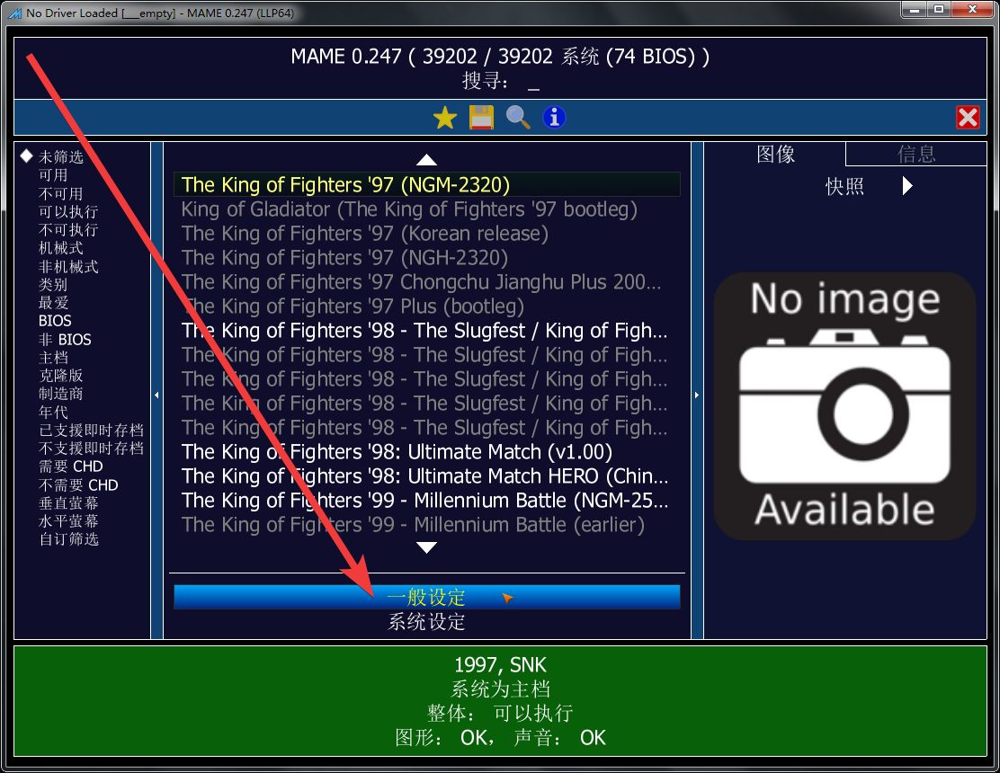
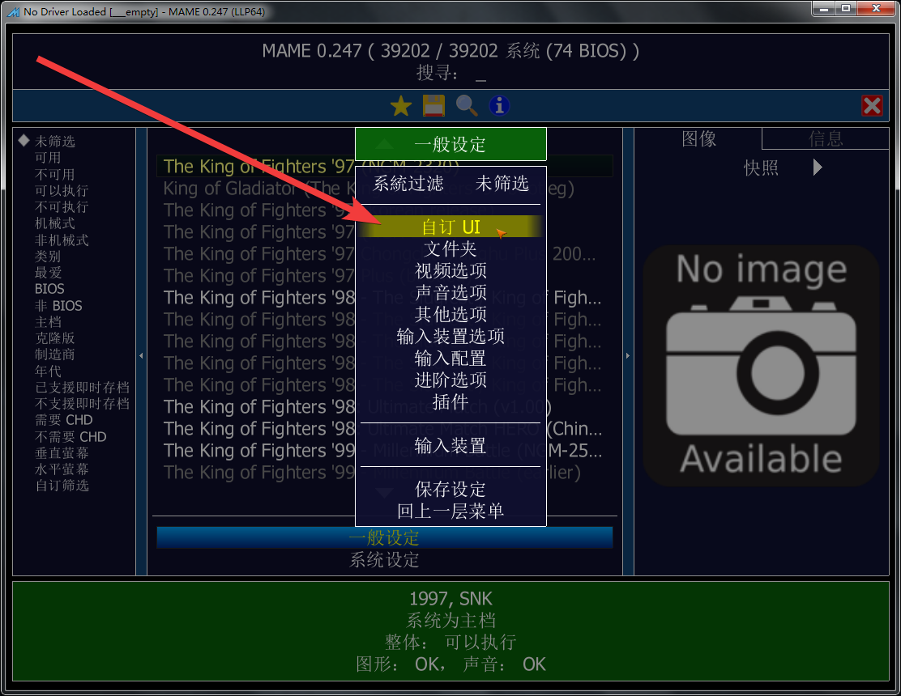
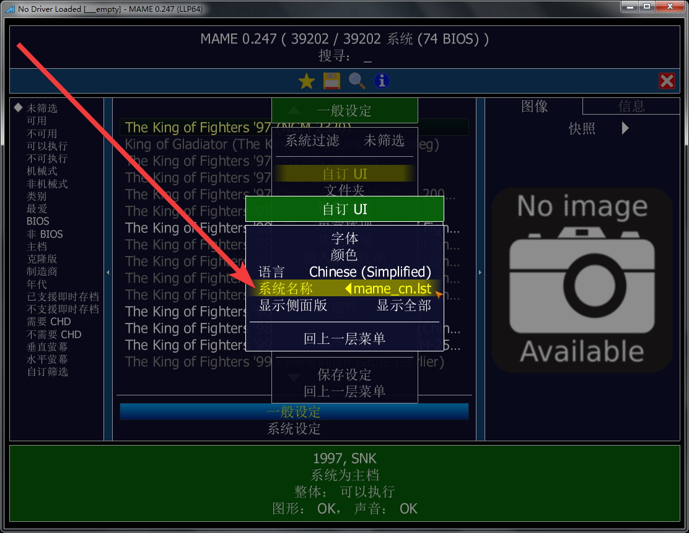
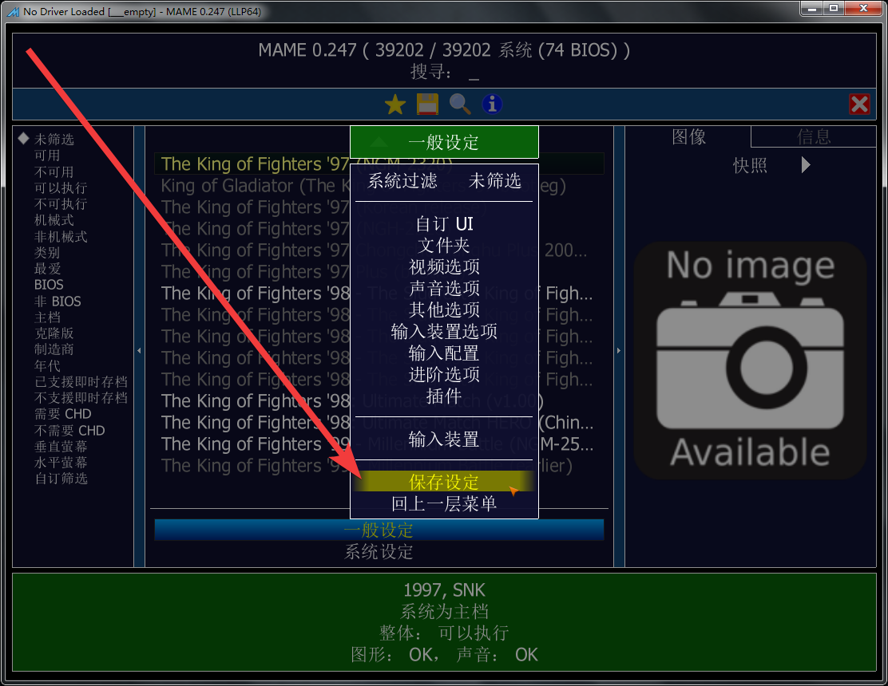
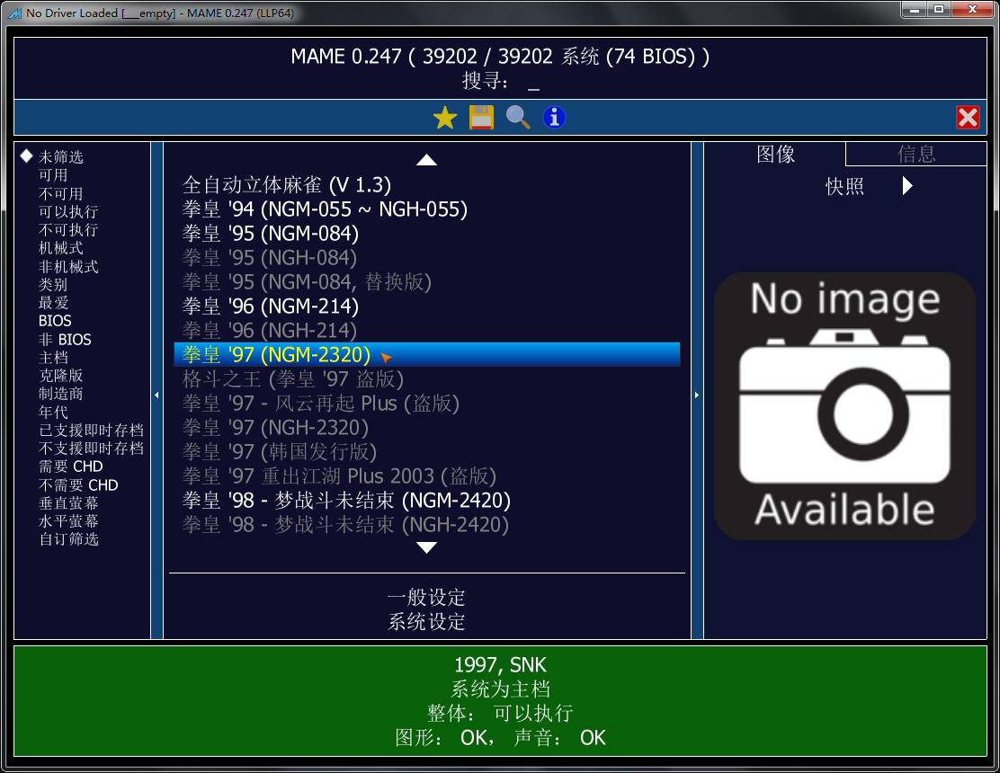

==================================
MAME 游戏列表 设为中文
==================================

版本要求
================

MAME 官方原版 的话，这个功能，要 0.237 版本以上。
	
	| 如果你使用的不是 官方原版 MAME 。
	|  比如：第三方的 MamePlus 等。
	|   其实，很久以前，MamePlus 中文 就支持得很好。（可惜的是，MamePlus 在 0.168 版之后，停止更新了）
	| 
	| 也可以用 官方原版 MAME 搭配一个支持中文的 前端，
	|  在前端中显示 中文游戏列表
	|   比如 MxUI 、JJui 、M+GUI （Mameplus 后期配套的前端，也同样没有人更新维护）、……等
	

下载中文列表
================

| 文件扩展名 得是 .lst 
| 文件名可以随意，比如：mame_cn.lst
| 把文件 放在 mame 所在文件夹，或 dats 文件夹 、history 文件夹

| 比如这里有资源：https://www.ppxclub.com/609487-1-1
| 但是 PPXCLUB 没有注册的话，可能看不到

MamePlus 源代码里面，也有，比如：

	| MamePlus 可能 原始的网址都失效了
	| 不过你可以搜一下，其它地方可能还有
	| 比如：https://github.com/svn2github/mameplus 
	|  位置 mamep/makelang/text/mame_cn.lst
	| MamePlus 停更很久了，当时的版本比较老，在新版本中使用的话，可能不够好。

别的地方如果有资源，下载也是一样的

文件格式
=================

因为当时官网提到了 MamePlus 、mame_cn.lst ，
我估计就是 MamePlus 的源代码文件 mame_cn.lst 一样的格式，
当时试了一下，确实可以。

如果需要手动编辑的话，格式也很简单

| 其实就是一个文本文件
| 文本编码 用 utf-8 带 bom
|   现在，好像 不是 utf-8 编码也可以了
| 
| 可以在文本编辑器里手写几条翻译试试效果
| 格式如下：
	
	| 一行开头是 游戏名英文缩写 比如：kof97
	| 之后是 制表符号（Tab键） 分隔一下
	| 之后是 翻译内容，比如：拳皇97
	| 之后重复一下 制表符号 与 翻译内容
	| （以前的 MamePlus 源代码里的原始翻译文本，就是这样重复一下的格式）
	| （不懂为什么要重复一下）
	| 注：试了一下，重复的部分，可以删除
	| 一行结束
	| 如果其它游戏需要翻译，在新的一行翻译，每条翻译占用一行

使用方法
==================

比如已经下载好了列表翻译文件：mame_cn.lst

文件名 可以改、文件扩展名 .lst 不要改

把文件 放在 mame 所在文件夹，或 dats 文件夹 、history 文件夹

如下图，选 【一般设定 General setting 】

如下图，选 【自订 UI】

如下图，【系统名称】，选择 中文游戏列表翻译文件 的 文件名

如下图，返回上一层，保存

如下图，好了，可以看到 中文游戏列表 了

缺点
===========

官方原版的 游戏列表界面 一直都很简陋。

如果是用的以前的版本，旧的游戏列表界面，更传统更简陋。

当然喜欢的话，现在也可以设置一下，使用旧的游戏列表界面。

我这里 0.260 版，再试了下：
	
	一般的程序有列表的话，通常会有一个滚动条，方便鼠标操作，它这里，目前还没有 滚动条。
		
		| 鼠标滚轮 可以让 列表上下滚动
		| 向上翻页 PageUp 键，列表向上翻一页
		| 向下翻页 PageDown 键，列表向下翻一页
		| Home 键，列表跳转到顶部
		| End 键，列表跳转到底部
		| 有些小键盘的话，可能节省空间，按键不全，找不到这些键。
	
	左侧的分类目录，第三方目录的支持还有点不行。
		
		| （第三方目录的话，一般都是文本格式的，文本编辑器就可以编辑）
		| （如果子目录用了中文，文本编码可以用 utf-8 带 bom 的）
		| （自己测试的话，遇到乱码，可以转换一下文件的 文本编码）
		
		似乎 第三方的目录，目前，只能显示一个条目，每一次切换另一个目录的话，很麻烦
		
		| 游戏数量成千上万。
		| 如果记得游戏名，可以搜一下，很快就能定位到某款游戏。
		| 如果不记得，或者得不准，找起来就麻烦了。
		| 可以自己做一个 第三方的目录，把自己喜欢的游戏添加到目录中，方便自己找到熟悉的游戏。
		| 这个 目录 一个小小的文件，也很方便备份。
		| 别的地方分享的第三方的目录，也可以拿过来看一看，一些常见的分类，里面也许很方便就能找到很多熟悉的游戏。
		| 官方原版 MAME 查看第三方目录不方便，可以使用 第三方 的 MAME 、或者使用 前端 UI 程序。