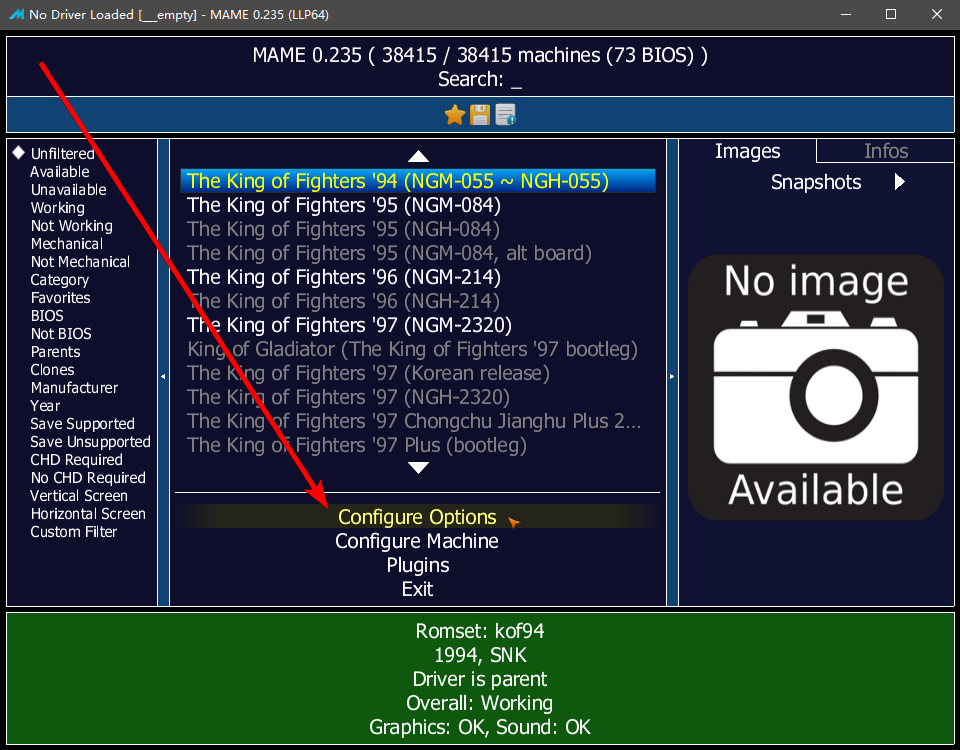
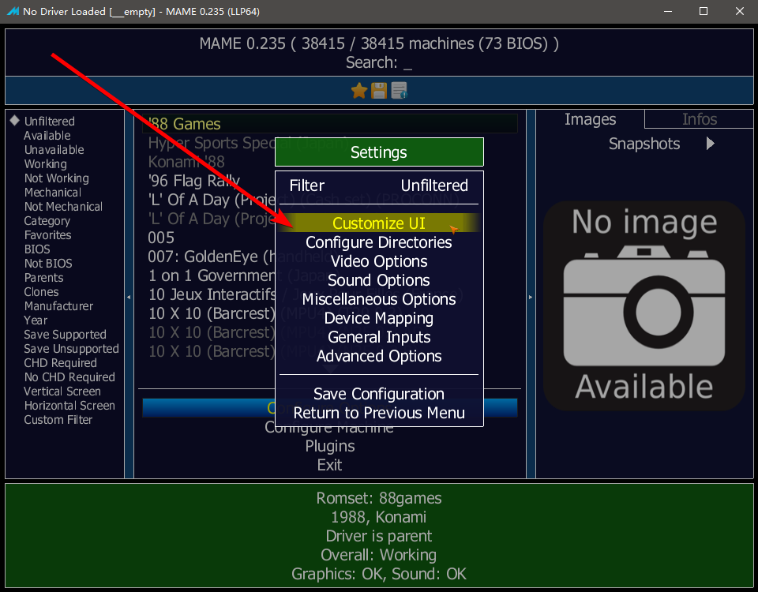
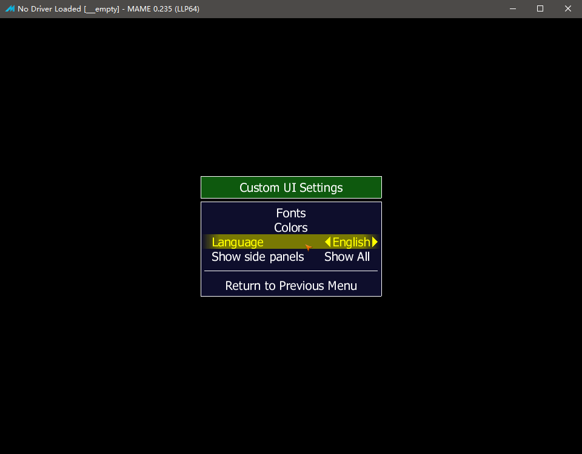
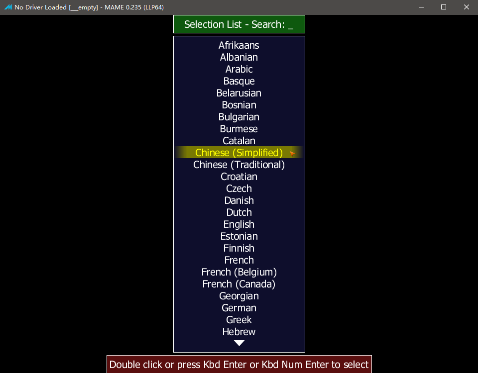
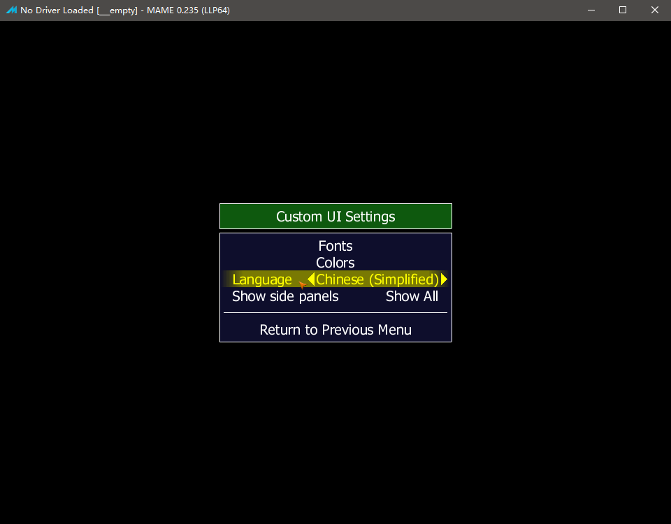
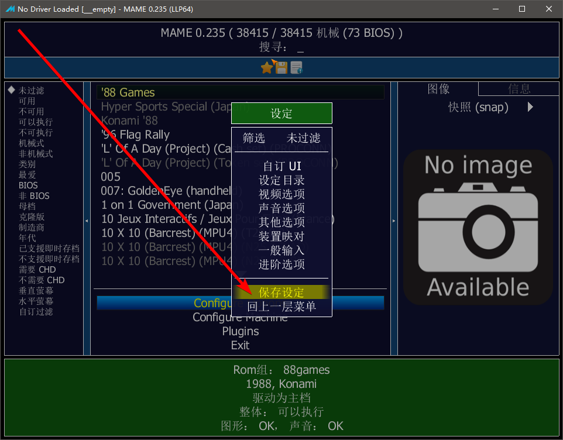
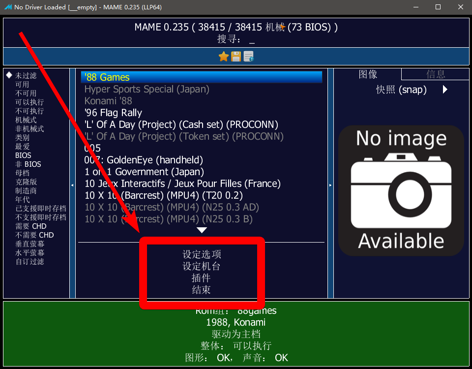
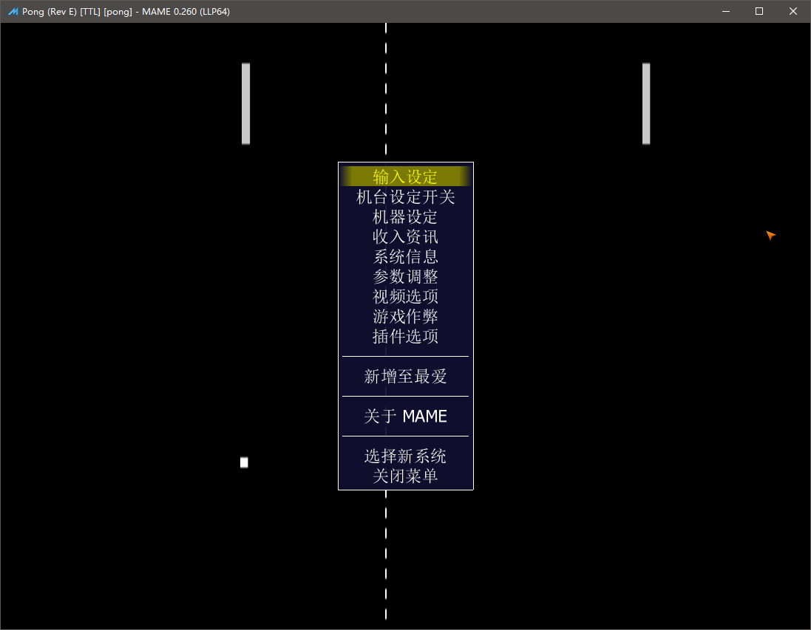

================================
MAME 选项菜单 设为中文
================================

将选项菜单调成中文
========================

官方原版 MAME 此功能 需要 0.171 版本以上。
	
	| 如果你使用的不是 官方原版 MAME 。
	| 比如：第三方的 MamePlus 等。
	| 其实，很久以前，MamePlus 中文 就支持得很好。
	| （MamePlus 在 0.168 版之后，停止更新了）

| 官方原版 MAME 默认的各种语言翻译文件的存放位置
| 是 language 这个文件夹
| 一般 官方原版 MAME 的文件应该比较全
| 如果是第三方的 MAME ，注意看一下文件有没有缺失

这里说一下，怎样，把选项菜单，调成中文。
	
	这个在进入游戏之前，在游戏列表界面中，选项改一下。
	
	界面选项可能有一些变化，
	我看了一下，当前的版本，和本页面的截图时用的版本，已有少许差异。

如下图：点击 【Configure Options (选项设置)】 
	
	下图中的 【Configure Options (选项设置)】
	
	看了一下 0.260 版本的，有点变化了，
	改成了 ， 【General setting (全体设置)】

如下图：点击 【Customize UI (设置 UI)】

如下图：点击 【Language (语言)】

如下图：选中 【Chinese Simplified (简体中文)】；底下红字提示：双击(Double Click) 或 按回车键(Press Enter) 选择。

如下图：回到上一层，看到 【Language (语言)】 选项的值 已经是 【Chinese Simplified (简体中文)】

如下图：回到上一层，点击 【Save Configuration (保存设定)】

那么，现在，选项菜单，已经是简体中文的了。

查看结果，第一处
====================

进入游戏之前的选项，显示中文

中文设置完成以后，进入游戏之前，如下图，有【设定选项】、【设定机台】、【插件】等选项 已经是中文的了。

	注：版本不同，选项排版，可能略有不同。
	
	比如 0.260 版本第一层菜单有：
		
		【General setting (全体设置)】，而下面截图则是 【Configure Options (选项设置)】
		
		【System settings (机台设置)】
		
		没有【插件（Plugins）】 了，它被 移到了 【General setting (全体设置)】 中。

查看结果，第二处
=========================

进入游戏以后，按 Tab 键，弹出的菜单，显示中文

中文设置完成以后，进入某个游戏以后，按 Tab 键，弹出的菜单，也同样，一些选项就是中文的了，如下图：

也可以手动编辑配置文件来修改选项
=======================================

如果喜欢手动编辑配置文件的话，也是可以的。

配置文件 mame.ini
	
	如果没有看到配置文件的话，需要，生成配置文件
		
		鼠标点一点选项，修改一些选项，保存后，一般就会自动生成配置文件了
		
		命令行操作的话，先进入 mame 所在目录，
			
			生成配置文件指令为：mame.exe -createconfig
			
			省略的写法：mame.exe -cc
	

配置文件中， 搜 language ，会搜到两个选项，不要改错了。
	
	::
		
		languagepath              language
		language                  
	
	| languagepath 这个选项表示所有语言包的位置，默认是 language 文件夹。这个不用改。
	| language 这个选项，设置不同的语言。

| 比如 0.260 版
| 打开 language 这个文件夹，可以看到很多子文件夹，存放着不同语言的翻译文件 。
| 在其中，很容易找到 简体中文 的文件夹：Chinese_Simplified 。

手动修改的话，比如 0.260 版，配置文件 mame.ini 中 language 选项
	
	默认值空着的，没有设置
		
		::
			
			language                  
	
	| 因为简体中文语言包放在了文件夹 language\\Chinese_Simplified
	| 此选项的值，可以修改为 对应的文件夹的名称 Chinese_Simplified
		
		::
			
			language                  Chinese_Simplified
	

翻译有些地方可能并不是很准确
=================================

至于调成中文以后，各种选项，都能看懂了，可以自己浏览一下。

有些地方可能没有翻译，漏掉了

有些地方也许不能翻译（程序员没有预留翻译接口）

有些地方翻译的质量可能不够好

MAME 是开源的，有能力的，还可以自己去翻译
