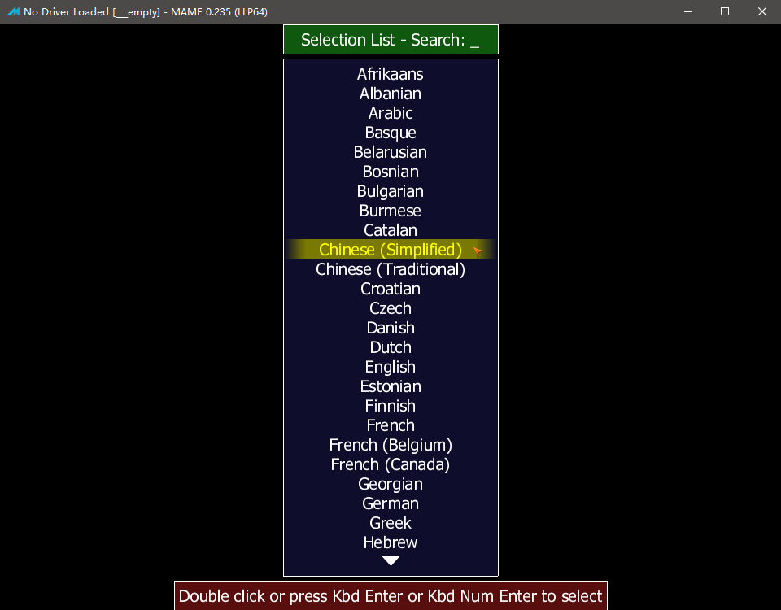
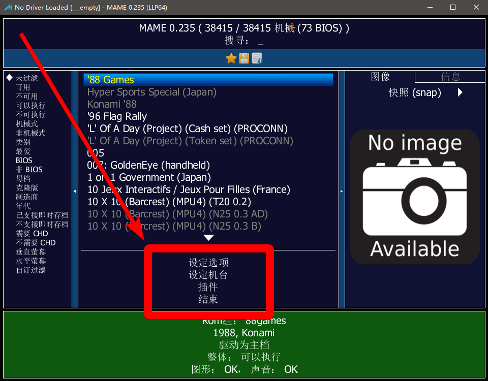

================================
MAME 选项菜单 设为中文
================================

官方原版 MAME 此功能 需要 0.171 版本以上。
	
	| 如果你使用的不是 官方原版 MAME 。
	| 比如：第三方的 MamePlus 等。
	| 其实，很久以前，MamePlus 中文 就支持得很好。
	| （MamePlus 在 0.168 版之后，停止更新了）

官方原版 MAME 的游戏列表界面，一直以来都很简陋。

这里说一下，怎样，把选项菜单，调成中文。
	
	界面选项可能有一些变化，
	我看了一下，当前的版本，和本页面的截图时用的版本，已有少许差异。

.. image:: images/mame_configure_choose_chinese_1.png
   :alt: 此处应显示图片

如上图：点击 Configure Options (选项设置)

.. image:: images/mame_configure_choose_chinese_2.png
   :alt: 此处应显示图片

如上图：点击 Customize UI (设置 UI)

.. image:: images/mame_configure_choose_chinese_3.png
   :alt: 此处应显示图片

如上图：点击 Language (语言)

如上图：选中 Chinese Simplified (简体中文)；底下红字提示：双击(Double Click) 或 按回车键(Press Enter) 选择。

.. image:: images/mame_configure_choose_chinese_5.png
   :alt: 此处应显示图片

如上图：回到上一层，看到 Language (语言) 选项的值 已经是 Chinese Simplified (简体中文)   

.. image:: images/mame_configure_choose_chinese_6.png
   :alt: 此处应显示图片

如上图：回到上一层，点击 Save Configuration (保存设定)

那么，现在，选项菜单，已经是简体中文的了。

这里，看一下，进入游戏之前，的设置，如下图，有【设定选项】、【设定机台】、【插件】等选项。

至于调成中文以后，各种选项，都能看懂了，可以自己浏览一下。

