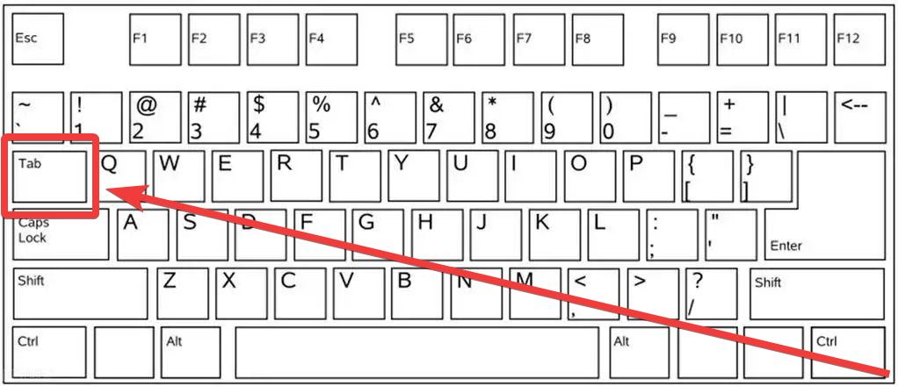

==========================================
MAME 进入游戏中的设置
==========================================

进入游戏
======================

首先是进入游戏，可能会显示一些提示信息。
::
	
	好像每一个游戏第一次运行游戏时，会有信息提示
	模拟状态不佳的游戏，会有相关提示
	游戏文件 dump 有问题的 游戏，会有相关提示
	…… 等等

新版本的话，出现提示信息，按任意键 就可以跳过 信息提示画面。没什么好说的。

如果是老版本的话，如果出现提示信息：
可能要 按回车键；
也有可能要输入英文OK (先按 O 键，再按 K 键) ；
或者 按 左右 等 操作；
才能跳过提示画面。

游戏中
=========================

重点提示就是：按 Tab 键。
	
	Tab 键的位置，在 Q 键的左边，在 大小写切换键 的上边。

没有用过 mame ，而且不看一下说明的 新用户，可能 想不出来 要按这么一个键，才能弹出 选项 菜单。

   

如下图，进入游戏之后，按 Tab 键，弹出选项菜单。
	
	按键的设置，如果修改的话，应该是保存在 cfg 文件夹里。

.. image:: images/mame_configure_8.png
   :alt: 此处应显示图片

可以看一下 Tab 菜单，首先第一件事，是了解游戏的按键：
::

	查看一下模拟器的相关功能的一些快捷键；
	再，查看一下 当前游戏 的 默认按键设置情况。

知道按键以后，就可以开始游戏了。

即然已经是中文菜单了
	
	仅简单介绍的话，其实，没有什么好说的了，很多选项设置，自己仔细看一看，大多都能了解了。
