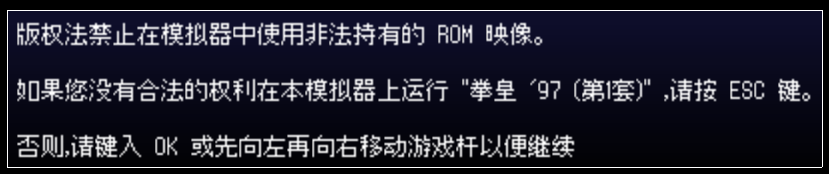
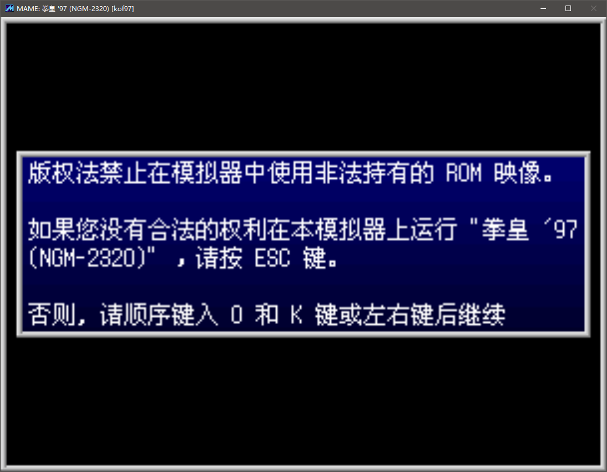
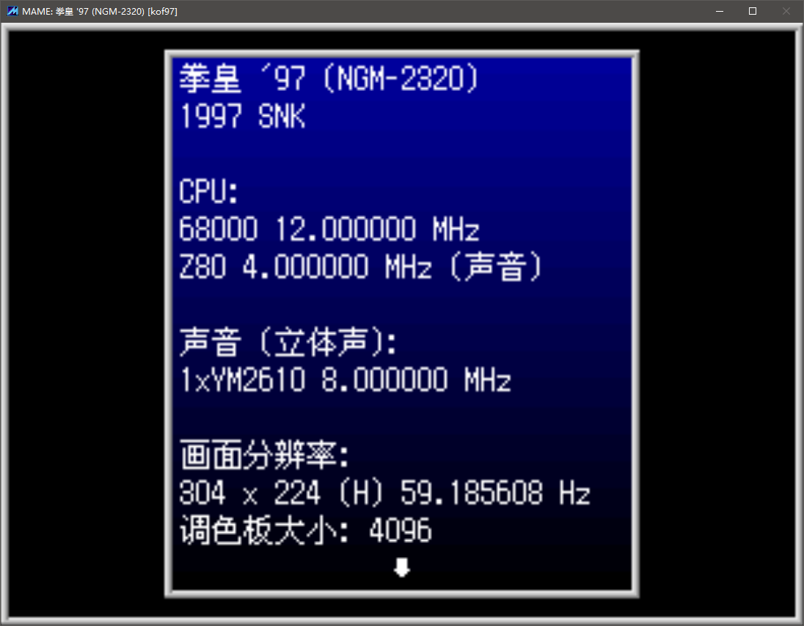

==============================================
(老版本) 游戏之前 的 信息提示
==============================================

如果是新用户，而且使用的是 老版本的 MAME ，可能会遇到非常奇怪的一个小问题。

选中某个游戏，进入游戏，此时，可能会有一些提示信息，这个时候，需要先跳过这些提示信息，然后，才能进入游戏。
	
	新版本的话，比较人性化，按任意键，都可以跳过提示信息画面；
	
	老版本的话，比较麻烦，要按指定的键。

一个游戏开始的时候可能有多条提示信息
	
	比如 版权 提示信息
	
	比如 显示当前游戏的信息
	
	比如 游戏文件 nodump 、baddump 提示
	
	等

OK 键（按O键 再按K键）
=================================

比如下图这样，输入 英文单词 OK （按O键 再按K键），或者 输入 左、右，即可跳过此类信息提示画面。
	
	如下图中，如果仔细点的话，看它的说明，也有提示按哪个键的。
	
	输入 英文单词 OK ，这种方式 非常特别
	
	新版本简化了此步骤， 按 任意键 就可以跳过信息画面

如下图，这样的提示信息：

如下图，另一个版本，稍微修改了一下文字描述方式：

（ 以上截图，不是 官方原版 MAME 的截图 ）

回车键
=======================

比如下图这样，输入 回车键 ，即可跳过此类信息提示的画面。
	
	新版本简化了此步骤， 按 任意键 就可以跳过信息画面

（ 以上截图，不是 官方原版 MAME 的截图 ）

