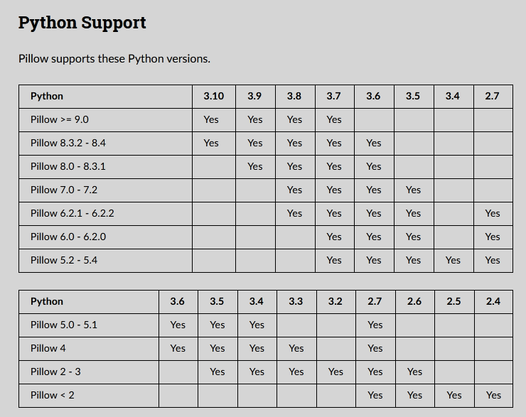

==========================================
使用 python 3.6 版
==========================================

目前的话，是使用的 python 3.6.8 版本写的 JJui
===================================================================

　　目前，MAME 比较新的版本的话，只发布 64 位的 exe 程序了，已经不发布 32位版本的 exe 了。兼容性的话，好像需要 windows 7 以上。（如果用老电脑，更早的操作系统，你可能需要使用 老版本的 MAME ，老版本的话，第三方的 MamePlus 当时 似乎更好用 对中文用户更友好）

　　windows xp 的话，python 3.4 之前的版本可以用。

　　windows 7 的话，python 3.8 以及之前的版本可以用。

　　但是 windows 7 的话，早已停止更新了，如果重装 windows 7 ，想要更新一下，估计是没戏了，反正我试了一下，windows 7 的在线更新功能，已经不行了。可能有第三方 提供的更新功能，懒得试了，而且估计第三方也不一定让人放心。

　　windows 7 ，比 sp1 更早的那个版本，连 python 3.6 也不能直接安装，需要先更新系统。

　　windows 7 sp1 的话，装好系统之后，可以安装 python 3.6 。安装 3.7 、3.8 的话有提示要先更新系统。

　　python 3.9 、python 3.10 不支持 windows 7 。

　　了解了一下兼容性之后，我把写 JJui 的 python 版本，改为 3.6.8 版本。python 3.6.8 版本，可以在官网上下载到 windows 的安装包程序，之后的 3.6.9 …… 等还有一些更新，但没有 windows 安装包程序。

使用 python 3.6.8
===================================================================

　　如果你用的是 打包好的 exe ，应该不需要关心这个问题。

　　如果你用更愿意直接使用脚本，可以了解一下。

　　如果使用其它版本，没有遇到什么特别的问题，也不用特意地切换到这个版本。

安装 python 3.6.8
-----------------------------

https://www.python.org

https://www.python.org/downloads/release/python-368/

　　从官网下载 python 3.6.8 程序的安装包，安装就是了，没有什么好说的。

　　安装选项里，默认已经选好了 tkinter 库（ JJui 显示的界面，就用的这个库）。这一步应该不用操心，你不要顾意地把这个选项去掉就行了。

　　中转器 py ，建议安装上。如果你之前安装了 更新 版本的 python ，估计已经装过了。

更新 pip 
-----------------------------

https://pypi.org/

　　pip 是用来在线更新第三方库的工具。因为 JJui 使用了第三库 Pillow (用来变化图片的大小)，需要用 pip 在线下载安装。

　　python 3.6 版本已经停止更新维护了。

　　那么更新 pip 就要注意一下，不能无脑更新到最新版，不兼容了。

　　可以更新到 21.3.1 版本。（这个可以去 pip 更新记录里查一下它啥子时候不支持 python 3.6 的）。

　　pip 不方便自己更新自己，使用 python -m 这样子来。

　　使用中转器的话，命令行里输入：
::

	py -3.6 -m pip install pip==21.3.1
	或者：
	py -3.6 -m pip install --only-binary :all: pip==21.3.1

　　不使用中转器的话，命令行里输入：(如果 python.exe 不在 path 里，或者 path 太乱，需要使用完整的路径)
::

	python.exe -m pip install pip==21.3.1
	或者：
	python.exe -m pip install --only-binary :all: pip==21.3.1

如果不更新 pip 的话？
----------------------------

如果不更新 pip 的话，可以在线安装吗？

Pillow 支持 python 3.6 的版本有很多，用一些比较老的版本的话，应该可以。

具体可以查一下 python 3.6.8 的时间，才去看一下 哪个版本的 pillow 是在这之前的，并且支持 python 3.6 的，应该就没有问题。

在线安装 Pillow 库
-----------------------------

看 一下 Pillow 的说明，它支持 python 3.6 的版本，从第 4 版到 8.4 版都可以。

　　使用中转器的话，命令行里输入：（python 3.6 停止更新维护了，安装二进制版本 --only-binary :all: ，）
::

	py -3.6 -m pip install --only-binary :all: Pillow==8.4

　　不使用中转器的话，命令行里输入：(如果 pip.exe 不在 path 里，或者 path 太乱，需要使用完整的路径)
::

	pip install --only-binary :all: Pillow==8.4

　　或者，可以把 8.4 版本号，换为其它的。尤其是，如果你不打算更新 pip ，那么可以试一下安装一些更古老的版本。

　　如果需要删除：
::

	py -3.6 -m pip uninstall Pillow

　　安装好了，测试一下，打开 JJui ，试一下。

可以离线安装吗？
------------------------------------

也是可以的，但是感觉没有必要。

可以去 pypi.org 下载好。

也可以用 pip 在线下载，保存好。

pip 在线下载安装第三方库，如果网络不好，可以换个源吗？
---------------------------------------------------------------------------
国内有好多源，可以使用。

比如清华的源，使用帮助：
https://mirrors.tuna.tsinghua.edu.cn/help/pypi/

不过我感觉，官方的源，还可以吧。

如果你需要使用国内的源，还可以再搜索一下，应该有好多的。

打开 JJui 打开
============================================

鼠标双击打开
------------------

如果只安装了一个版本的 python 。
	安装好 python 以后，再，在线安装好 Pillow 库 （期间通常需要先更新 pip ）。
	
	默认应该会关联好 ``*.py 、 *.pyw`` 等文件
	
	这样，直接鼠标双击，打开 JJui.pyw 即可。
	
	（如果默认没有关联好 ``*.py 、 *.pyw`` 等文件，你鼠标双击没有正常打开，
	
	（回到目录处，点击查看 有关于 中转器 的说明。	

如果你安装了多个版本的 python ，使用的是 默认版本的 python ，一样的。

如果你同时安装了多个版本的 python ，并打算使用旧版本的 python 来打开 JJui ：
	回到目录处，点击查看 关于 中转器 的说明。

如果没有关联错误的话：

``*.py``  文件是 命令行模式，鼠标双击打开，会有一个命令行窗口

``*.pyw`` 文件是 图形窗口模式，会隐藏命令行窗口，适合有窗口界面的程序

命令行打开
-------------------

首先，命令行进入 JJui.pyw 所在的文件夹。（如果不进入 JJui.pyw 所以文件夹，你得输入它的完整路径）

然后

通过中转器打开

::

	py JJui.pyw
		使用 默认的 python 版本
	py -3.6 JJui.pyw
		指定 python 版本为 python 3.6
		
		（这样是命令行模式，你关闭命令行窗口，它跟着关闭了；
		（你暂停命令行窗口，它就卡死了，因为它是 单线程 的程序。所以不要把主程序给暂停了。
			（回到目录里，查看关于命令行的话题，有提到怎样关闭 鼠标 一点击命令行窗口 ，命令行就暂停的功能。
	
	
	或者
	
	pyw JJui.pyw
		使用 默认的 python 版本
	pyw -3.6 JJui.pyw
		指定 python 版本为 python 3.6
		
		（这样是图形窗口模式，你关闭命令行窗口，也不会影响到它。
	
	（因为中转器的话，如果你安装了它，它会被添加到系统的某个文件夹里，在环境变量里。
	（这样，不需要指定 py 或 pyw 的完整路径。

不用中转器通过 python 打开
::

	python.exe JJui.pyw
	或者
	pythonw.exe JJui.pyw
	
		（如果 python.exe 不在环境变量里，那你得把它替换为完整的路径
		（比如 C:\xxxx\yyyy\zzz\????\python.exe 这种可能很长的一串路径

``*.py``  文件 ，``*.pyw`` 文件，
在命令行模式里不用特别在意后缀是什么，
而是看你用 python.exe （中转器 py.exe） 还是用的 pythonw.exe （中转器 pyw.exe）去打开脚本
